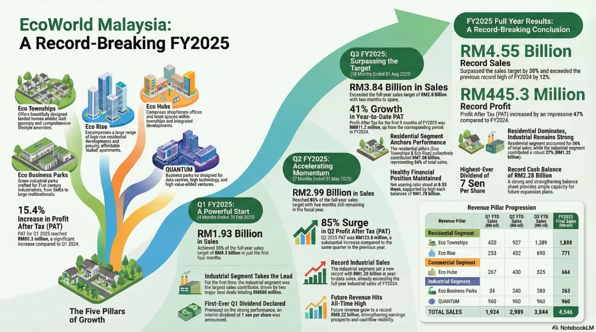

# The Financial Blueprint: Unpacking EcoWorld’s Record-Breaking FY2025

**Date:** December 10, 2025  
**Company:** Eco World Development Group Berhad (EcoWorld)  
**Ticker:** ECOWLD (Bursa Malaysia)  
**Fiscal Period:** FY2025 (Nov 1, 2024 – Oct 31, 2025)

---

## 1. Introduction
### The Story Behind the Numbers

In the world of investing, financial statements are the report cards of a business. They strip away the marketing hype and tell us the cold, hard truth about a company's health. Whether you are a day trader looking for momentum or a retiree seeking steady income, learning to read these "report cards" is the single most valuable skill you can possess.

Today, we are putting **EcoWorld Development Group Berhad** under the microscope. By all accounts, their Fiscal Year 2025 (FY2025) was not just good—it was historic. The property developer, known for its signature "Eco" townships and burgeoning industrial parks, has delivered a set of financial results that sets a new benchmark for the sector.

In this deep dive, we will move beyond the headlines. We will dissect how EcoWorld smashed its sales targets by 30%, why its pivot to industrial data centers is a game-changer, and what its record-low debt levels mean for your portfolio.

**Why This Matters:**
* **For Beginners:** You will learn how to read a property company's health beyond just "house sales."
* **For Pros:** We will evaluate the sustainability of their 47% profit jump and the strategic shift toward recurring income.

---

## 2. Revenue Analysis
### The Top Line: Where the Money Comes From

Revenue (or Sales) is the lifeblood of any company. It represents the total value of goods and services sold before any expenses are deducted. For a property developer, this usually means the value of homes, shops, and factories sold to customers.

#### The Headline Numbers
In FY2025, EcoWorld generated **RM4.55 billion** in total property sales. To put this in perspective:
* **The Goal:** Their original target was RM3.5 billion.
* **The Result:** They beat their own target by **30%**.
* **The Driver:** This wasn't luck; it was a broad-based success across multiple regions and distinct business pillars.

#### Segment Breakdown: The "Three Engines"
Advanced investors know that *where* the revenue comes from is just as important as *how much* comes in. Diversification reduces risk. EcoWorld’s revenue stream is geographically balanced:

| Region | Sales Contribution (RM) | % of Total | Strategic Insight |
| :--- | :--- | :--- | :--- |
| **Iskandar Malaysia (Johor)** | RM2.27 Billion | **50%** | The heavy hitter. Benefiting from the Johor-Singapore RTS link and data center boom. |
| **Klang Valley (KL/Selangor)** | RM1.75 Billion | **39%** | The stable core. High demand for urban living and upgrades. |
| **Penang** | RM524 Million | **11%** | The niche market. Steady contribution from the northern corridor. |

#### The Strategic Shift: Industrial is the New "Hero"
For years, residential housing was the undisputed king of EcoWorld's portfolio. While it still accounts for **58%** of sales (driven by the *Eco Townships* and *Eco Rise* pillars), the real story of FY2025 is the explosion of the **Industrial Segment**.

* **Industrial Sales (Eco Business Parks & QUANTUM):** RM1.22 Billion (27% of Total Sales).
* **The Catalyst:** A massive demand for data centers and high-tech manufacturing.
* **Key Clients:** Global tech giants like Microsoft Payments, Pearl Computing, and Deye New Energy.

> **Investor Note:** The industrial segment didn't just grow; it accelerated. By the mid-year mark, industrial sales had already surpassed the *entire* previous year's total. This indicates a structural shift in the market, not just a temporary spike.

---

## 3. Profit Margins & Cost Analysis
### The Bottom Line: Efficiency and Execution

Revenue is vanity, but profit is sanity. It is not enough to sell RM4.55 billion worth of property if it costs you RM4.50 billion to build it. We need to look at **Profit After Tax (PAT)**—the actual earnings available to shareholders.

#### Exploding Profitability
EcoWorld reported a PAT of **RM445.3 million** for FY2025.
* **Growth:** This is a staggering **47% increase** compared to FY2024.
* **Efficiency:** A 47% profit jump on the back of strong sales indicates "Operational Leverage." This means EcoWorld’s fixed costs (like HQ salaries and admin) are being spread over a much larger revenue base, leading to fatter margins.

#### Analyzing the Margins
While the raw data doesn't provide the exact gross margin percentage, we can infer high efficiency from the business mix:
1.  **Premium Pricing:** 81% of residential sales were for homes priced above **RM650,000**. Premium homes generally command better margins than affordable housing.
2.  **Industrial Land Sales:** Selling industrial plots (especially to data centers) often involves lower construction complexity compared to building high-rise condos, potentially aiding margin preservation.

#### Operational Risks
For the fundamental investor, the risk in property development is usually rising construction costs (steel, cement, labor). EcoWorld’s ability to deliver record profits suggests they have managed these costs effectively, likely locking in material prices early or passing costs on to premium buyers who are less price-sensitive.

---

## 4. Dividend Review
### The Paycheck: Passive Income for Shareholders

For the **Dividend Hunter**, this is the most critical section. Dividends are the cash payments companies make to their owners (you) from their profits.

#### The FY2025 Payout
EcoWorld declared a total dividend of **7 sen per share**.
* **Historical Context:** This is the highest dividend payout in the company's history.
* **Significance:** It signals management confidence. Companies rarely raise dividends to record levels unless they believe the cash flow is sustainable.

#### The "Yield" Trap vs. Sustainable Growth
Beginners often chase the highest percentage yield, but smart investors look for *sustainability*.
* **Payout Ratio:** With a PAT of RM445.3 million, EcoWorld is distributing a healthy portion of its earnings while retaining enough cash for future growth.
* **Consistency:** The company has established a track record of rewarding shareholders. The shift toward recurring income (renting out data centers) suggests that future dividends could become even more stable and predictable, rather than fluctuating with property sales cycles.

---

## 5. Balance Sheet & Financial Health
### The Health Check: Assets, Liabilities, and Solvency

The Balance Sheet tells us what the company *owns* (Assets) versus what it *owes* (Liabilities). In property development, debt is the biggest killer. Let's see if EcoWorld is playing it safe.

#### 1. Cash Position (Liquidity)
* **Cash Balance:** **RM2.28 Billion**.
* **Analysis:** This is a record-high cash pile. High liquidity is crucial for two reasons:
    * **Defense:** It acts as a buffer against economic downturns.
    * **Offense:** It allows the company to snap up cheap land or fund construction without borrowing at high interest rates.

#### 2. Gearing Ratio (Solvency)
* **Net Gearing:** **0.28 times (0.28x)**.
* **What this means:** For every RM1.00 of equity (shareholder money), the company has only RM0.28 of net debt.
* **The Verdict:** This is exceptionally low for a property developer. Property is a capital-intensive game, and many competitors run gearing ratios of 0.5x or higher. A 0.28x ratio means EcoWorld is "light" on debt. They are not over-leveraged.

> **Risk Assessment:** With interest rates globally remaining elevated, having low debt is a massive competitive advantage. EcoWorld is paying less in interest expenses, which directly boosts the bottom line.

---

## 6. Cash Flow Analysis
### The Pulse: Following the Cash

Profits can be manipulated by accounting rules, but cash flow is fact.

#### Investing Cash Flow: Planting Seeds for Tomorrow
EcoWorld is not sitting on its success. The data highlights significant future investments:
* **New Land Banks:** Acquisitions like *Eco Business Park VII* in Negeri Sembilan and *Eco Business Park 8* in Kulai.
* **Recurring Income Assets:** Investing in the construction of a data center for *Pearl Computing Malaysia*.

#### The "Recurring Income" Pivot
This is a critical insight for **Long-Term Investors**. Traditionally, developers sell a house once and the income stops. EcoWorld is changing this model.
* **The Strategy:** Build assets (like data centers) and lease them out for long periods (e.g., 20 years).
* **The Goal:** Target 20% - 30% of future earnings to come from recurring rental income.
* **Cash Flow Implication:** This transforms lumpy, unpredictable project sales into smooth, predictable monthly cash flow.

---

## 7. Investment Implications
### What Should You Do?

Based on the financials, here is how different types of investors might view EcoWorld right now.

#### 🟢 For Retail & Beginner Investors
* **The Play:** EcoWorld is a "blue-chip" style property stock. It is easy to understand: they build houses and factories, and they are selling them faster than they can build them.
* **Action:** Good entry point for exposure to the Malaysian property market without high debt risk.

#### ⚡ For Traders & Short-Term Players
* **The Play:** Momentum. The "Data Center" narrative is hot. With 50% of sales coming from Iskandar Malaysia (the data center hub), EcoWorld is a proxy trade for the tech boom.
* **Catalyst:** Watch for news on the completion of the Microsoft or Pearl Computing facilities. These milestones often spike the stock price.

#### 💎 For Long-Term Fundamental Investors
* **The Play:** Value and Growth. You are buying a company with record cash (RM2.28b), low debt (0.28x), and a clear pivot toward recurring income.
* **Thesis:** The management has proven they can navigate market cycles. The shift to industrial real estate diversifies them away from the cyclical risks of the housing market.

#### 💰 For Dividend Hunters
* **The Play:** Growing Income. 7 sen is a record payout.
* **Outlook:** As the recurring income from data centers starts kicking in (targeting 20-30% of earnings), the dividend could become very "sticky" (reliable) and potentially grow further.

*Disclaimer: This analysis is based on the Q1 FY2026 financial report and is for educational purposes only. It does not constitute a recommendation to buy or sell. Please consult a licensed financial planner before making investment decisions.*

---

## 8. Key Takeaways

If you only read one section, make it this one. Here is the summary of EcoWorld's FY2025:

* **Sales Super-Cycle:** Total sales hit **RM4.55 billion**, beating targets by 30%. This is not a drill; demand is real and backed by actual signed contracts.
* **Profit Explosion:** Net profit soared **47%** to RM445.3 million. The company is becoming more efficient at turning revenue into shareholder profit.
* **Fortress Balance Sheet:** With **RM2.28 billion in cash** and a low **0.28x gearing ratio**, the company is financially bulletproof against moderate economic shocks.
* **The Industrial Revolution:** The future isn't just houses. 27% of sales now come from industrial parks and data centers, positioning EcoWorld as a key player in the digital economy infrastructure.
* **Shareholder Rewards:** A record **7 sen dividend** proves that management is willing to share the wealth.

**Final Verdict:** EcoWorld has transitioned from a pure residential developer into a diversified real estate powerhouse. Their financials show a company that is aggressive in growth but conservative in financing—a rare and attractive combination for investors.

---

### About Eco World Development Group Berhad
[Eco World Development Group Berhad](https://ecoworld.my/) is one of Malaysia’s leading property developers. It focuses on three key economic regions: the Klang Valley, Iskandar Malaysia, and Penang. The brand is synonymous with "Eco" living, prioritizing green townships, security, and lifestyle infrastructure.

---

### 📍 Location / Headquarters & Contact Info
- Headquarters: Menara EcoWorld, Bukit Bintang City Centre (BBCC), Kuala Lumpur.

---

### 📈 When it was listed on Bursa & Listing History
- The "EcoWorld" brand assumed the listing status (via Focal Aims Holdings) in roughly 2014
- Sector: Property
- Main Market

---


