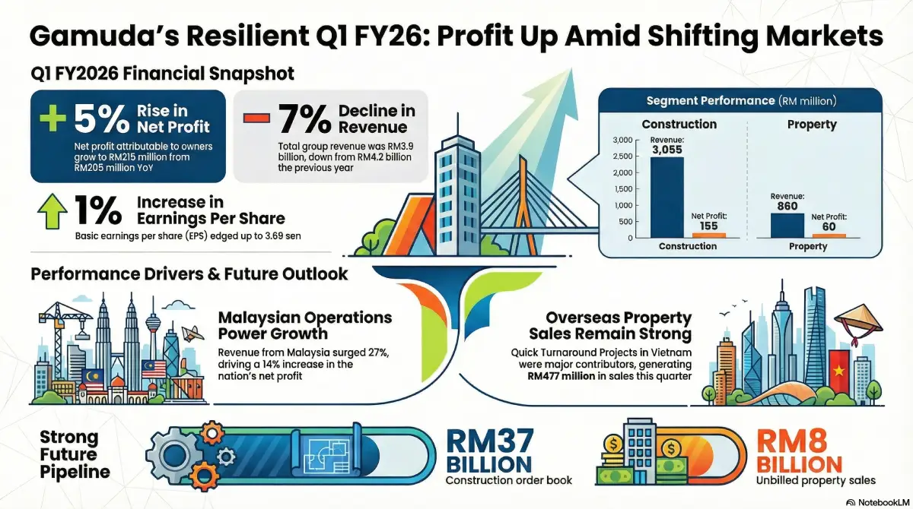
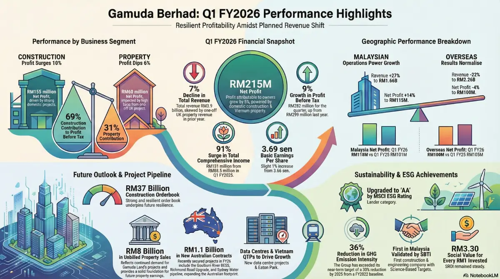

# Gamuda Berhad (5398) Q1 FY2026 Review: A Construction Giant in Expansion Mode

**Date:** December 10, 2025  
**Stock Code:** 5398 (Bursa Malaysia)  
**Sector:** Construction & Engineering / Property

---

## 1. Introduction: The Blueprint of a Nation Builder

If you have driven through the SMART Tunnel during a storm, taken the MRT to work in Kuala Lumpur, or admired the master-planned townships of Kota Kemuning or Valencia, you have interacted with the work of **Gamuda Berhad**. As one of Malaysia’s largest infrastructure and property companies, Gamuda is often seen as a bellwether for the nation's construction sector.

However, recognizing a company’s brand is very different from understanding its stock. For investors, the "product" isn't just the bridges or tunnels—it is the **Financial Statements**.

Reviewing these statements is critical because they strip away the marketing noise. They tell us if the company is efficiently turning contracts into cash, if their debt is manageable, and if they are growing in a way that is sustainable for your portfolio.

In this deep-dive review, we are analyzing Gamuda’s **Q1 FY2026** results (covering the period up to 31 October 2025). Whether you are a total beginner trying to buy your first stock, or a seasoned trader looking for an entry point, this analysis breaks down the numbers that matter.

---

## 2. Revenue Analysis: Decoding the "Top Line"

For beginners, **Revenue** (or Turnover) is the total amount of money the company brought in before paying any expenses. It’s the raw measure of demand for their services.

### The Headline Numbers
* **Q1 FY2026 Revenue:** RM 3.91 Billion
* **Q1 FY2025 Revenue:** RM 4.19 Billion
* **Year-over-Year (YoY) Change:** -7%

### The "Why": Don't Panic at the Red Ink
Seeing a 7% drop in revenue might initially look like a sell signal. However, context is everything in financial analysis.

The dip is attributed to a **high base effect** from the previous year. In Q1 FY2025, Gamuda recognized a large chunk of "lumpy" revenue from a property project in the United Kingdom. "Lumpy" means it happened all at once and isn't repeated every quarter.

**The "Real" Growth Story:**
If we exclude that one-off UK event, the core business actually **grew by 3%**. This growth was driven by the domestic market.
* **Malaysia (Domestic) Revenue:** RM 1.66 Billion (+27% YoY)
* **Overseas Revenue:** RM 2.26 Billion (-22% YoY)

### Implication for Investors
* **Short-Term Traders:** You might see a knee-jerk reaction in the stock price due to the headline "revenue drop." This often presents a buying opportunity if the underlying business is healthy.
* **Long-Term Investors:** Focus on the **Domestic Construction** segment. Revenue here surged by **53%**. This indicates that Gamuda is aggressively executing local projects (like the Penang LRT and Data Centres), which provides a stable baseline for the coming years.

---

## 3. Profit Margins & Cost Analysis: Efficiency Over Volume

While Revenue is vanity, **Profit** is sanity. Even though Gamuda sold *less* (lower revenue), they kept *more* (higher profit). This is a hallmark of an efficiently run business.

### Key Profit Metrics
1.  **Profit Before Tax (PBT):** RM 282.3 Million (**+9%** YoY)
2.  **Net Profit (Attributable to Owners):** RM 215.1 Million (**+5%** YoY)
3.  **Basic Earnings Per Share (EPS):** 3.69 sen (vs 3.66 sen last year)

### Understanding the Margins
* **Gross vs. Net:** While the report focuses on PBT, the 9% jump in Pre-Tax Profit despite a revenue drop suggests **margin expansion**. This means their costs to build projects or sell homes were managed better, or they are executing higher-margin contracts.
* **Segment Performance:**
    * **Construction:** This division contributed **69%** of the group's pre-tax profit. Net profit for this segment rose **10%**. Domestic construction profit specifically skyrocketed **35%**.
    * **Property:** Contributed **31%** of profit. While profit here dipped slightly (-6%), this was expected due to the UK project completion. The excitement here lies in Vietnam, where "Quick-Turnaround-Projects" (QTPs) are seeing profits surge by **43%**.

### What This Means for You
For a fundamental investor, rising EPS (Earnings Per Share) is the golden ticket. It means the company is becoming more valuable on a per-share basis. The shift in profit contribution toward the Construction arm suggests that for the next 12–24 months, Gamuda is an **infrastructure play**, not just a property developer.

---

## 4. Dividend Review: The Income Perspective

Dividends are the cash payments companies send to shareholders from their profits. For **Dividend Hunters**, this is the most important section.

### The Current Status
* **Dividend Declared (Q1):** None.
    * *Note:* This is standard for Gamuda. They typically announce dividends in Q2 (Interim) and Q4 (Final).
* **Historical Yield:** Gamuda traditionally offers a yield between **2.5% to 3.5%**.

### Sustainability Check (Payout Ratio)
To know if a dividend is safe, we check if the company earns enough to pay it.
* **Net Profit:** RM 215.1 Million.
* **Cash Flow from Operations:** RM 255.1 Million.

The company is generating significantly more cash from operations than it did last year (RM 65.7 million in Q1 FY25). This **strong cash generation** confirms they have the capacity to maintain their dividend payout when the time comes in Q2.

However, investors should note the company's "Growth Phase" status. Management is reinvesting heavily (see Section 6). Usually, when a company spends billions on expansion, dividend growth might be capped in the short term to preserve cash.

---

## 5. Balance Sheet & Financial Health: Under the Hood

The Balance Sheet is a snapshot of what the company **owns** (Assets) vs. what it **owes** (Liabilities) at a specific moment in time.

### The Asset Base
* **Total Assets:** RM 31.8 Billion (Up from RM 30.3 Billion).
* **Net Assets Per Share:** RM 2.11.
    * *Beginner Tip:* If the stock price is trading close to RM 2.11, you are buying the company near its "book value," which is often considered a safer entry point.

### The Debt Situation (Solvency)
* **Total Liabilities:** RM 19.3 Billion.
* **Gearing Ratio:** **62%** (increased from 53%).

**Is this dangerous?**
A gearing ratio of 62% means the company has significant debt relative to its equity. For a tech company, this would be alarming. For a construction giant, it is manageable but requires monitoring.
* **Why the increase?** The report explicitly states this debt was taken on to **purchase new landbanks** for the property division and fund joint ventures.
* **Good Debt vs. Bad Debt:** This appears to be "Good Debt"—borrowing money to buy assets (land) that will generate future profits, rather than borrowing just to pay the bills.

---

## 6. Cash Flow Analysis: Following the Money

Cash flow is often harder to manipulate than accounting profits. Gamuda’s cash flow statement tells a story of aggressive expansion.

### 1. Operating Cash Flow (The Engine)
* **Net Cash Generated:** **+RM 255.1 Million** (vs RM 65.7 Million last year).
* **Insight:** This is a massive improvement. It means the core business is collecting cash from clients faster and more efficiently. This provides a safety cushion.

### 2. Investing Cash Flow (The Future)
* **Net Cash Used:** **-RM 1.34 Billion**.
* **Where did it go?**
    * RM 577.6 Million: Capital injection into Joint Ventures.
    * RM 373.1 Million: Buying land for property development.
* **Insight:** Gamuda is planting seeds. They are spending big now to ensure they have property to sell and projects to build in FY2027 and beyond.

### 3. Financing Cash Flow (The Fuel)
* **Net Cash Generated:** **+RM 1.81 Billion**.
* **Insight:** This largely comes from a net drawdown of borrowings (RM 1.99 Billion). They borrowed money to fund the investments mentioned above.

---

## 7. Investment Implications by Profile

Based on the data above, here is how different types of investors should view Gamuda right now.

### 🟢 Beginner & Retail Investors
* **Action:** **Accumulate on weakness.**
* **Why:** Gamuda is a "Blue Chip" stock—stable, large, and well-managed. The complex financials boil down to a simple truth: they have a record order book (RM 37 Billion) that guarantees work for years. It is a safe way to gain exposure to Malaysia's economy.

### 🟡 Traders & Short-Term Players
* **Action:** **Watch the RM 3.90–RM 4.20 technical levels.**
* **Why:** The headline "revenue drop" might cause a temporary dip in price. This is your setup. Look for news on the **Penang LRT** or **Data Centre** awards as catalysts that will pop the price back up. The market loves infrastructure news right now.

### 🔵 Long-Term Fundamental Investors
* **Action:** **Buy and Hold.**
* **Why:** The fundamentals are improving. EPS is up, margins are up, and the company is successfully pivoting to Data Centre construction (a high-growth area). The high gearing is a risk, but management has a 20-year track record of navigating debt successfully. The "Intrinsic Value" is growing as they acquire more land.

### 🟣 Dividend Hunters
* **Action:** **Neutral / Hold.**
* **Why:** If you strictly need high income *now*, Gamuda might be underwhelming compared to a REIT or Bank stock (which yield 5-6%). Gamuda is currently a "Growth with Income" stock. Expect steady dividends, but don't expect a massive special dividend while they are in this spending cycle.

*Disclaimer: This analysis is based on the Q1 FY2026 financial report and is for educational purposes only. It does not constitute a recommendation to buy or sell. Please consult a licensed financial planner before making investment decisions.*

---

## 8. Key Takeaways

If you only remember five things from this report, make them these:

1.  **Core Strength:** Despite a 7% drop in total revenue (due to one-off overseas items), **Net Profit grew 5%**, proving the company is running more efficiently.
2.  **Domestic Boom:** The Malaysian construction arm is on fire, with revenue up **53%** and profits up **35%**.
3.  **Future Visibility:** They have an Order Book of **RM 37 Billion** and Unbilled Property Sales of **RM 8 Billion**. This is a massive safety net.
4.  **Aggressive Expansion:** Management is borrowing money (Gearing at 62%) to buy land and fund ventures. They are playing offense, not defense.
5.  **ESG Leader:** Gamuda isn't just building concrete; they are building green. With upgraded ESG ratings (AA) and renewable energy targets, they are "future-proofing" against regulatory risks.

---

## 9. Company Profile

For those new to the stock, here is the snapshot of the business entity:

* **Company Name:** Gamuda Berhad
* **Ticker Code:** 5398
* **Listed On:** Main Market, Bursa Malaysia
* **Listing Date:** 10 August 1992 (Founded in 1976)
* **Headquarters:** Menara Gamuda, PJ Trade Centre, Petaling Jaya, Selangor.
* **Core Businesses:**
    * **Engineering & Construction:** Metros (MRT), Highways, Tunnels, Water Treatment, Data Centres.
    * **Property Development:** Townships (Gamuda Land) in Malaysia, Vietnam, Singapore, UK, and Australia.

---


