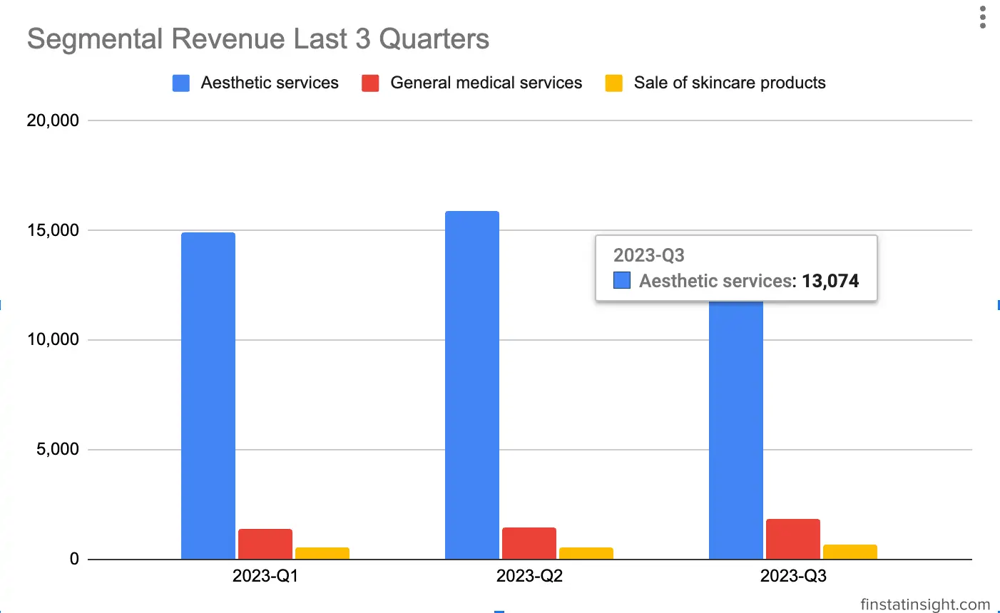
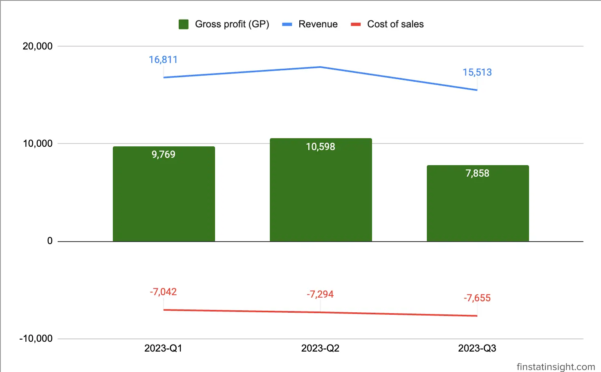
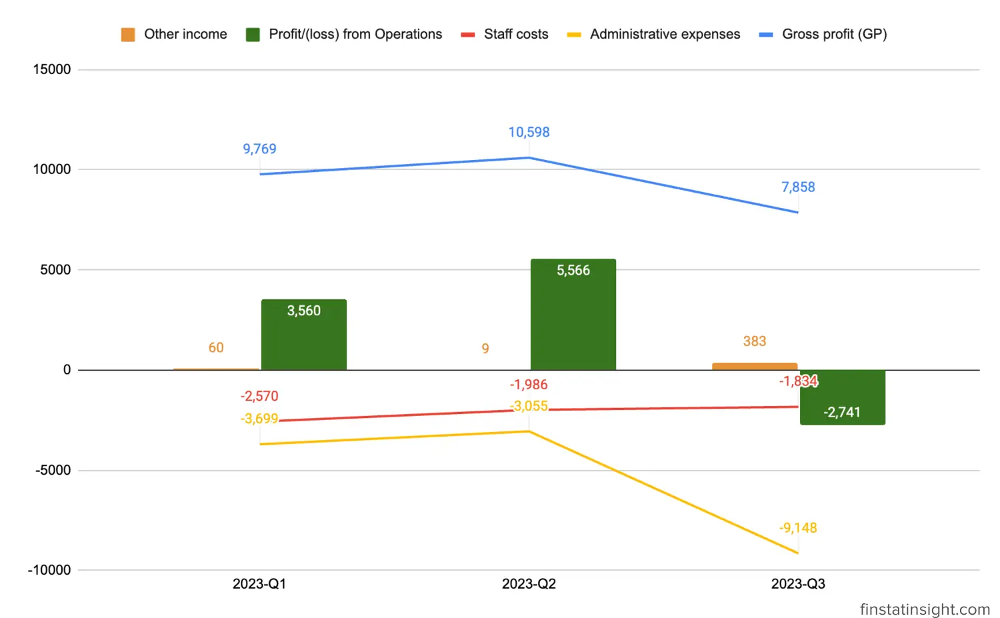
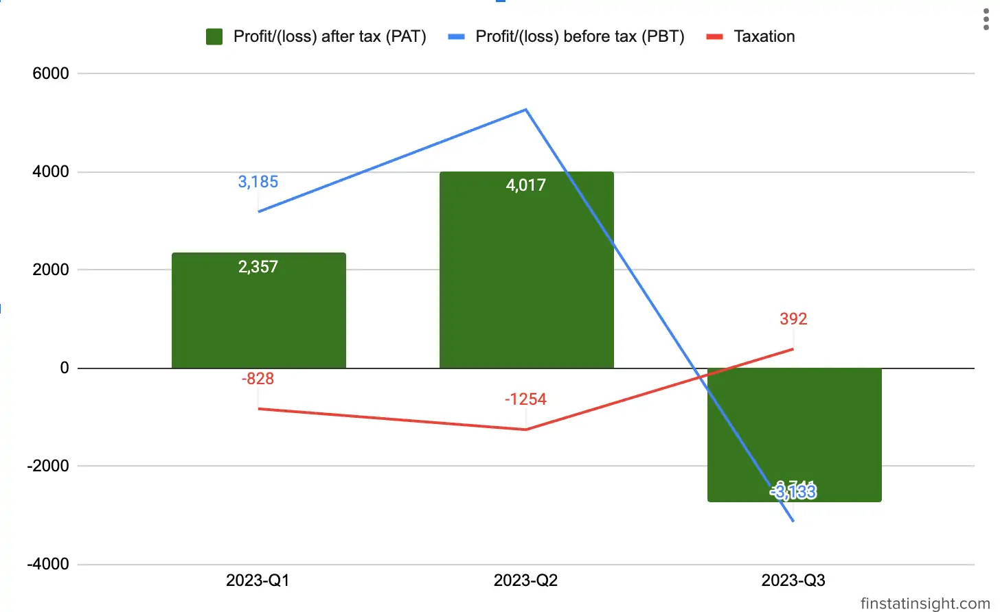

### Q3-2023 Summary
**Revenue:** The Group reported a revenue of RM15.52 million for the current financial quarter, with a significant focus on aesthetic services, contributing approximately 84.28% of the total revenue.

Below is the chart & table showing the segmental analysis of the group's revenue for the past 3 quarters.

|      Quarters       | 2023-Q1 | 2023-Q2 | 2023-Q3 |
|---------------------|---------|---------|---------|
| Items             | 3/31/2023 | 6/30/2023 | 9/30/2023 |
| Aesthetic services  | 14,930  | 15,923  | 13,074  |
| General medical services | 1,379 | 1,432 | 1,804   |
| Sale of skincare products | 502 | 537   | 635     |
| **Total**               | **16,811**  | **17,892**  | **15,513** |

**Loss Before Tax:** Despite the revenue generated, the Group recorded a loss before tax amounting to RM3.13 million. This loss was primarily attributed to administrative expenses totaling around RM9.15 million.

**Administrative Expenses Breakdown:** The substantial administrative expenses included one-off non-recurring listing expenses and consultancy fees related to the IPO exercise, amounting to RM3.85 million for the quarter under review. Substracting 3.85 millions, there is 5.3 millions of "others" administrative expenses. 

**Adjusted Profit Before Tax:** Adjusting for the one-off listing expenses and consultancy fees associated with the IPO exercise, the company achieved an adjusted profit before tax of RM0.72 million for the financial quarter under review.

This financial snapshot indicates a challenging quarter for DC Healthcare Holdings Berhad, marked by a significant loss before tax primarily due to ***exceptional expenses*** related to the IPO exercise. However, the adjusted profit before tax reflects a more positive underlying operational performance once these one-off costs are excluded. It suggests that, beyond the exceptional expenses, the core business activities are contributing positively to the company's financial position.

### Latest 3 Quarters Profit & Loss Statements Analysis

Below is table consists of 3 quarters Profit & Loss Statements data.

| Quarters                         | 2023-Q1 | 2023-Q2 | 2023-Q3 |
|----------------------------------|---------|---------|---------|
| Periods                          | 3/31/2023 | 6/30/2023 | 9/30/2023 |
| Revenue                          | 16,811  | 17,892  | 15,513  |
| Cost of sales                    | -7,042  | -7,294  | -7,655  |
| Gross profit (GP)                 | 9,769   | 10,598  | 7,858   |
| Other income                     | 60      | 9       | 383     |
| Staff costs                      | -2,570  | -1,986  | -1,834  |
| **Administrative expenses**          | -3,699  | -3,055  | **-9,148**  |
| Profit/(loss) from Operations     | 3,560   | 5,566   | -2,741  |
| Finance costs                    | -375    | -295    | -392       |
| Profit/(loss) before tax (PBT)   | 3,185   | 5,271   | -3,133  |
| Taxation                         | -828    | -1,254  | 392     |
| Profit/(loss) after tax (PAT)    | 2,357   | 4,017   | -2,741  |
| Other comprehensive income, net of tax |         | 1       |         |
| Total comprehensive income for the financial period | 2,358 | 4,017 | -2,741 |
| Profit for the financial period attributable to Owners of the Company | 2,357 | 4,017 | -2,741 |
| Total comprehensive income for the financial period attributable to Owners of the Company | 2,357 | 4,017 | -2,741 |
| Earnings per share attributable to Owners of the Company: Basic/Diluted (sen) | 0.3 | 0.5 | -0.28 |

Let's analyze the financial data presented in the table for each quarter and provide insights for investors:

**Revenue Trend:**
Revenue has experienced fluctuations across quarters, starting at 16,811 in Q1, peaking at 17,892 in Q2, and then declining to 15,513 in Q3.

**Gross Profit and Cost of Sales:**
Gross profit (GP) has followed a similar trend to revenue, indicating a consistent gross profit margin.
Investors should closely monitor the cost of sales to ensure that the company maintains healthy profit margins and operational efficiency.

**Operating Expenses:**
Administrative expenses have shown a significant increase in Q3, primarily due to one-off non-recurring listing expenses and consultancy fees related to the IPO exercise amounting to RM3.85 million. But it doesn't explained further the other RM5.3 million which balooning the administrative expenses to RM9.15 million this Q3.

**Profitability:**
Profit before tax (PBT) has experienced volatility, with a positive trend in Q2 but turning negative in Q3.
The decline in profitability in Q3 is attributed to softened profit margins in medical aesthetic services, higher staff costs, and reduced bookings.

**Earnings Per Share (EPS):**
Earnings per share (sen) have shown a decline in Q3, reaching -0.28 sen, indicating a negative impact on shareholder returns.
Investors should assess the company's plans to enhance EPS and its commitment to delivering shareholder value.

> The Group believes that its prospects in the aesthetic medical service industry are favourable in view
of our competitive strengths.
>
> <cite>– DC Healthcare Holdings Berhad Q3 Interim Financial Report</cite>
***



### Growth Plan / Aquisitions of I Bella Sdn Bhd

DC Healthcare's proposed acquisition of 200,000 ordinary shares in **I Bella Sdn Bhd** ("IBella") from Then Yen Tsing ("TYT") and Arrow Peak Sdn Bhd ("Arrow Peak") signifies a strategic move to obtain 100% equity interest in IBella. The total purchase consideration for this acquisition is set at a substantial amount of up to RM70,000,000.

The proposed transaction will be structured with a combination of cash and the issuance of new ordinary shares in DC Healthcare. Specifically, up to RM35,000,000 will be paid in cash as the Cash Consideration, while the remaining RM35,000,000 will be satisfied by issuing 60,344,828 new ordinary shares in DC Healthcare at an Issue Price of RM0.58 per Share. These newly issued shares, referred to as "Consideration Shares," are a significant component of the overall purchase consideration.

This acquisition strategy allows DC Healthcare to leverage its existing financial resources through a combination of liquid assets (cash) and equity issuance. The issuance of new shares serves as a means of financing the acquisition, providing an alternative to using exclusively cash reserves.

The Issue Price of RM0.58 per Share is a critical aspect of the transaction, representing the valuation at which DC Healthcare is willing to dilute its ownership in exchange for acquiring IBella. The pricing reflects the perceived value of IBella and the strategic importance of the acquisition to DC Healthcare's overall business objectives.

Upon completion of the Proposed Acquisition, DC Healthcare will gain complete ownership of IBella, potentially unlocking synergies and strategic advantages for both entities. The acquisition aligns with DC Healthcare's growth strategy, allowing the company to diversify its portfolio or strengthen its position in the market.

### About DC Healthcare Holdings Berhad

**DC Healthcare Holdings Berhad** is a Malaysian company that provides top-quality skin and aesthetic treatments complemented by world-class client care and professionalism. They aim to be the catalyst for transformative change in the field, driven by advanced technology and a genuine, compassionate, patient-centered approach.

**Headquarters Location**
- Suite 22.01, 22.02 & 22.05, Level 22, Centrepoint South, Mid Valley City, Lingkaran Syed Putra, 59200, Kuala Lumpur, Wilayah Persekutuan.

**Listed on Bursa Malaysia**
- Listed on the **ACE Market** of Bursa Malaysia,
- Dated July 17, 2023, under the stock code **0283**.
- Sector: HEALTH CARE.

### DC Healthcare Holdings Berhad Background

DC Healthcare Holdings Berhad, established in 2016, began as a general medical services provider before strategically transitioning to specialize in non-invasive and minimally invasive aesthetic procedures. The key milestones and features of the company include:

- Founding and Evolution: Commenced in 2016 with the first clinic in Kuala Lumpur, it expanded and diversified over subsequent years.
- Strategic Shift: Transitioned to aesthetic services in April 2017, focusing on non-invasive procedures to meet the growing demand.
- Geographical Expansion: Extended operations to Singapore and currently operates 13 aesthetic medical clinics across major cities.
- Impressive Team: Employs a dedicated team of 10 LCP Certified Aesthetic Physicians, 29 resident medical doctors, and numerous clinic managers and consultants.
- State-of-the-Art Facilities: Boasts a robust infrastructure with 32 consultation rooms and 69 treatment rooms equipped with advanced technology.

DC Healthcare is a dominant player in the aesthetic medicine market with a substantial market share of 11.1%. Key operational and financial aspects include:

- Revenue Composition: In FY22, the aesthetic services segment contributed RM46.7 million, constituting 90% of total revenue, emphasizing the company's strategic focus.
- Treatment Portfolio: Offers diverse aesthetic treatments, including facial and skin procedures, body contouring, hair removal, and skincare product sales.
- Awards and Recognition: Recently achieved accolades such as the TEOXANE Most Resilient Award 2022, SOBA 2020 Best Brand (Gold), and SOBA 2020 Best Use of Technology (Gold).
- Strategic Diversification: Actively sells skincare products under the brands Le Perfetto and 10 Drs, showcasing a commitment to holistic skincare solutions.
- Future Plans: Embarking on an ambitious expansion plan, aiming to establish eight new aesthetic clinics in major Malaysian cities and investing in advanced laser machines for continued technological advancement.
- This dual-pronged strategy of providing comprehensive general medical services and leading the aesthetic medicine market, coupled with strategic expansion plans, positions DC Healthcare for continued success and growth in the dynamic healthcare industry.

