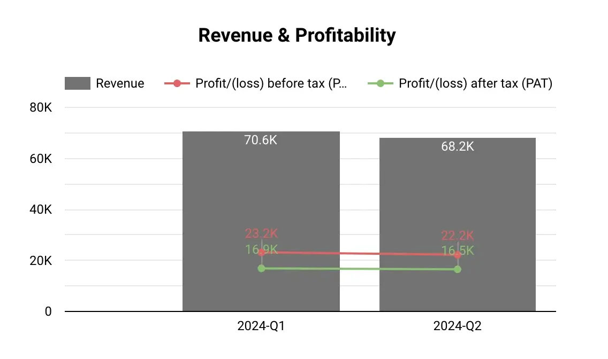
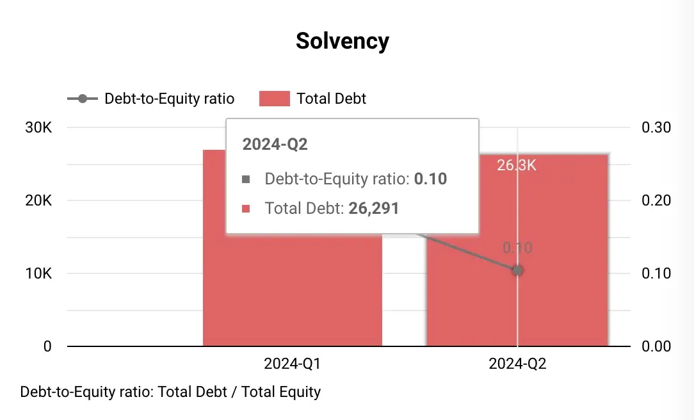
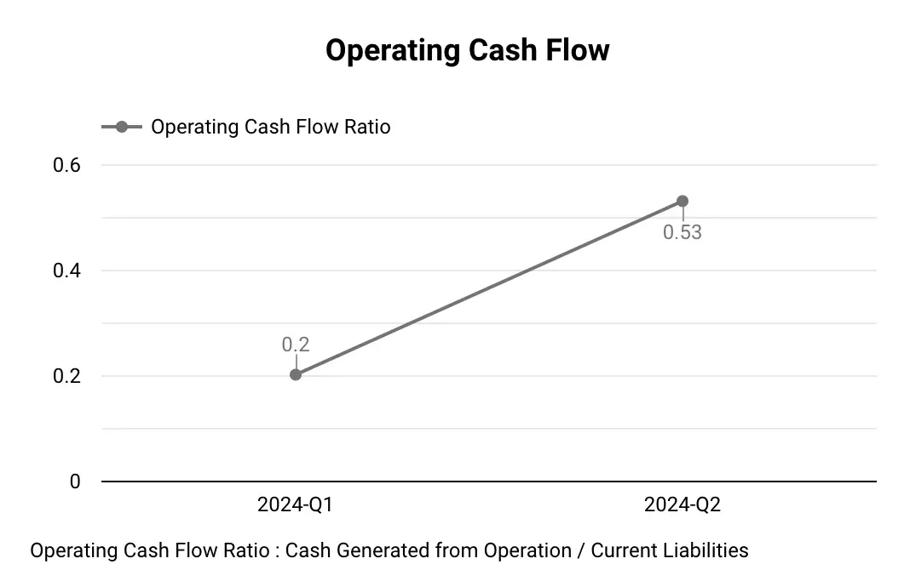

**Feytech Holdings Berhad**, a leading manufacturer of automotive seats and covers in Malaysia, has announced strong financial results for the second quarter ended 30 June 2024. The company's revenue and profitability continue to be driven by the expansion of its manufacturing operations and the robust demand for its products.
Here are some key highlights of Feytech's Q2 performance.

As of Q2 2024, RM21 million of the IPO proceeds had been utilized, primarily for working capital. The remaining funds are allocated for land acquisition, construction of new facilities, purchase of machinery, and listing expenses.

## Profit and Loss Analysis
- **Revenue** reached RM68.20 million for the quarter, a marginal decrease of 3% from the previous quarter. This decrease was primarily attributed to a decline in customer demand for automotive covers. The company's automotive seat segment generated RM36.95 million in sales, accounting for 54.18% of total revenue, while the automotive cover segment contributed RM31.25 million or 45.82%. It's evident that the automotive covers segment experienced a more significant decline, while the automotive seats segment remained relatively stable.
- **Profit before tax (PBT)** stood at RM22.23 million, with a PBT margin of 32.60%. Notably, this figure includes one-off listing expenses of approximately RM1.05 million incurred during the quarter. After adjusting for these expenses, the adjusted PBT reached RM23.28 million, reflecting a robust adjusted PBT margin of 34.14%.
- **Profit after tax (PAT)** amounted to RM16.52 million, representing a PAT margin of 24.23%.

### Latest 3 Quarters Profit & Loss Statements Analysis

Below is table consists of last 3 quarters Profit & Loss Statements data.

| **Quarters**          | 2024-Q1        | 2024-Q2        |
|-----------------------|----------------|----------------|
| Years                        | 2024      | 2024      |
| Revenue                                                   | 70,645   | 68,195   |
| Cost of sales                                             | -42,491 | -41,447 |
| Gross profit (GP)                                         | 28,154   | 26,748   |
| Other income                                              | 2,229    | 1,024    |
| Administrative expenses                                   | -6,902  | -5,235  |
| Profit/(loss) from Operations                             | 23,481   | 22,537   |
| Finance costs                                             | -311    | -306    |
| Profit/(loss) before tax (PBT)                            | 23,170   | 22,231   |
| Taxation                                                  | -6,288  | -5,709  |
| Profit/(loss) after tax (PAT)                             | 16,882   | 16,522   |



## Balance Sheet Highlights
### Assets
- **Property, plant, and equipment:** Decreased slightly from RM41.005 million in Q1 to RM40.254 million in Q2 . This reduction could be due to depreciation, asset sales, or both.
**Inventories:** Rose from RM40.760 million in Q1 to RM44.978 million in Q2. This buildup might signal the company stocking up in anticipation of future demand. It could also suggest challenges in inventory management, something to keep an eye on.
- **Trade and other receivables:** Increased from RM57.676 million in Q1 to RM59.515 million in Q2. This rise could indicate potential issues with collecting payments from customers, which might affect cash flow.
- **Cash and short-term deposits:** Surged from RM43.773 million in Q1 to RM162.175 million in Q2. The IPO proceeds are the most likely explanation for this substantial increase.

### Liabilities
- **Loans and borrowings:** Decreased slightly from RM27.068 million in Q1 to RM26.291 million in Q2. Feytech might be actively repaying debt or strategically managing its borrowings.
- **Trade and other payables:** Dropped significantly from RM37.832 million in Q1 to RM32.252 million in Q2. This decrease could be related to Feytech's payment practices and relationships with suppliers.

### Equity
- **Share Capital:** Jumped from RM87.484 million in Q1 to RM199.263 million in Q2. This significant increase reflects the issuance of new shares during the IPO.
- **Retained Earnings:** Grew from RM122.674 million in Q1 to RM139.196 million in Q2, indicating Feytech's profitability during this period.
- **Net Asset Value (NAV) per Share:** Increased significantly from RM0.18 in Q1 to RM0.30 in Q2. The substantial influx of cash from the IPO is the primary driver of this increase.

## Cash Flow Statement Insights

- **Operating Cash Flow:** Feytech generated RM19.962 million in net cash from operating activities in Q2 2024 . This positive cash flow is driven by the company's profitability and changes in working capital components.
- **Investing Cash Flow:** Feytech used RM111.856 million in net cash for investing activities in Q2 2024.
A notable outflow is the RM988,000 spent on purchasing property, plant, and equipment. This investment is aligned with the company's expansion plans, which we'll discuss in more detail later.
- The most significant item here is the change in **pledged deposits**, amounting to RM111.001 million. This likely relates to Feytech's financing activities and might involve using deposits as collateral for loans or other financial instruments.
- **Financing Cash Flow:** Feytech used RM89.872 million in net cash for financing activities in Q2 2024.

### Let's break down the key components:
- **Proceeds from issuance of shares:** Feytech received RM114.66 million from its IPO. This inflow significantly boosted the company's cash position.
- **Drawdown and repayment of term loans:** Feytech drew down RM500,000 in term loans and repaid RM777,000 during the quarter. This suggests active debt management.
- **Dividend payments:** RM20.223 million was paid out in dividends.
- **Payment of share issuance expenses:** Feytech incurred RM2.881 million in expenses related to the IPO.

## Feytech's Key Growth Drivers:
Feytech's continued success is underpinned by strategic initiatives aimed at capitalizing on the favorable market conditions within the automotive industry in Malaysia:
-  **Expansion of Automotive Seat Manufacturing:** Feytech is aggressively expanding its automotive seat production capacity:
- The company successfully relocated its operations from Kulim Plant 1 to the more spacious Kulim Plant 3 in June 2024.
- **Construction of Kulim Plant 2** is underway, adding another 84,000 square feet of manufacturing space to support the automotive seat division.
- Feytech is in the process of **acquiring land** in the **Automotive High-Tech Valley**, with plans to establish an additional manufacturing facility there. This strategic move aims to broaden the company's customer base by targeting automotive vehicle OEMs located in this automotive hub.
-  **Expansion of Automotive Covers Division:** To better cater to customers in the central region of Malaysia, Feytech is undertaking a significant expansion of its automotive covers division:
- The company is planning to construct a **new corporate office in the Klang Valley**, integrated with a manufacturing plant and warehouse. This new facility will replace the existing PJ Hub, providing a more strategic location and enhanced operational capabilities.

### Future Outlook:
The Board of Directors at Feytech Holdings Berhad expresses confidence in the company's future prospects, anticipating positive contributions from its expansion plans. The company's commitment to expanding its manufacturing capacity, coupled with the ongoing demand for its automotive seats and covers, positions it well for continued growth and profitability.

However, it is essential to acknowledge that external factors, such as the overall economic climate in Malaysia, government policies and regulations, and competition within the automotive industry, can potentially influence Feytech's performance.

### Feytech's Management Challenges:
Addressing Declining Demand for Automotive Covers: Feytech's management needs to counteract the declining demand for automotive covers. Potential strategies include:
- Product diversification: Expanding into new product lines within the automotive accessories market or related industries could reduce reliance on a single product segment.
- Market research: In-depth market research to understand shifting consumer preferences and identify new market opportunities could guide product development and marketing efforts.
- Competitive pricing strategies: Adjusting pricing to remain competitive in the market while maintaining profitability.

### Managing Working Capital Effectively: 
The increase in inventories and trade receivables calls for effective working capital management to ensure sufficient cash flow. Feytech should focus on:
- Optimizing inventory levels: Implement inventory management systems to ensure optimal inventory levels and - minimize storage costs while meeting demand.
- Improving collection processes: Streamline invoicing and collections to reduce outstanding receivables and minimize the risk of bad debts.
- Negotiating favorable payment terms with suppliers: Extend payment terms with suppliers to improve cash flow, while maintaining good relationships.

### Conclusion
Feytech's Q2 2024 financial performance showcases a company in a dynamic growth phase. While revenue declined slightly due to challenges in the automotive covers segment, the company remains profitable, with an adjusted PBT exceeding that of Q1. The IPO significantly bolstered Feytech's cash position, providing resources to fuel its ambitious expansion plans.

Feytech's future appears promising. However, management faces key challenges, including addressing declining demand for automotive covers, effectively executing large-scale expansion projects, maintaining profitability amidst these investments, and managing working capital efficiently. The company's success will depend on its ability to navigate these challenges strategically and adapt to evolving market conditions.

### About Feytech Holdings Berhad

[Feytech Group] (https://www.feytech.com.my/) is a leading manufacturer of automotive covers and seats based in Malaysia. With over two decades of experience, the company has expanded its operations to include the manufacturing of automotive seats in 2021. Feytech Holdings serves both the Original Equipment Manufacturer (OEM) and Pre-Delivery Inspection (PDI) markets, manufacturing covers and seats for new automotive vehicles. Additionally, they cater to the restyling, replacement, and repair (REM) market, providing covers for used vehicles.

**Location**
- No. 1, Jalan Bayu 2/6, Kawasan Perindustrian Tampoi Jaya 81200 Johor Bahru, Johor Darul Ta’zim MALAYSIA

**Listed on Bursa Malaysia**
- Listed on the **Main Market** of Bursa Malaysia,
- Dated 21-May-2024, under the stock code **5322**.
- Sector: Auto Parts

