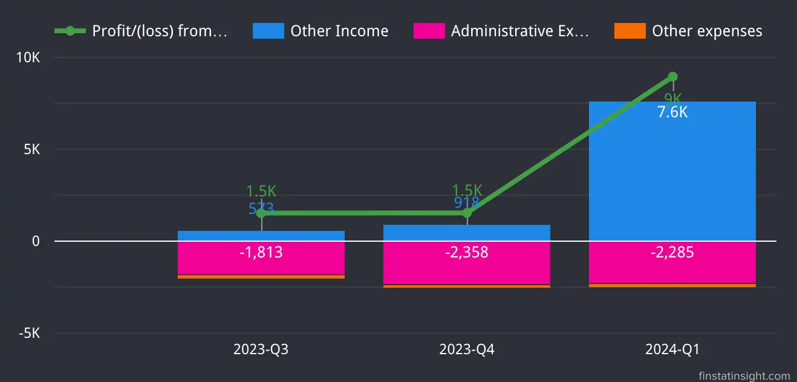

### Jati Tinggi Group Berhad Q1-2024 Summary
In the quarter ending February 29, 2024, the Group's revenue decrease to RM29.01 million, down from RM35.99 million in the preceding quarter ended November 30, 2024. The revenue decline aligns with the construction activities and progress of the Group’s ongoing projects as below:
- The Danga Bay Project (double circuit underground cable installation from Danga Bay substation to Perling substation, Johor) contributed RM0.86 million in the current quarter, down from RM4.94 million in the preceding quarter.
- The installation, testing, and commissioning of 33kV underground cables and accessories from Keteri South substation to Chuping Valley Industrial Area (CVIA) substation, Perlis, generated RM1.82 million in the current quarter, compared to RM2.24 million in the preceding quarter.

But, despite the revenue drop, the Group registered higher profit before taxation (RM8.18 million) and profit after taxation (RM7.24 million) for the first quarter ended 29 February 2024, which represent 24.94% net profit margin, primarily due to the gain of RM 7.24 million **disposal of investment property**.

### Prospect & Order Book
#### 1. New Contract Awarded:
Jati Tinggi Holding Sdn Bhd has secured a contract worth RM22.06 million. The project involves laying underground cables for a data centre in the southern region of Peninsular Malaysia. The contract was awarded by Worktime Engineering Sdn Bhd.

**Project Details:**
- The project involves laying a 275kV underground cable double circuit.
- The scope includes power and fibre optic cables, joint and termination works, and other ancillary tasks.
- The contract period is 13 months, starting from March 27, 2024.

#### 2. New Collaboration Contract:

**Parties Involved:**
- Jati Tinggi Group Bhd's wholly-owned subsidiary, Jati Tinggi Holding Sdn Bhd (JTSHB)
- Worktime Engineering Sdn Bhd (WESB)
- Tenaga Nasional Bhd (TNB) as the awarding entity

**Contract Value and Distribution:**
- Total contract value: RM25.5 million
- Jati Tinggi Holding Sdn Bhd's share: 30% (RM7.65 million)
- Worktime Engineering Sdn Bhd's share: 70% (RM17.85 million)

**Project Scope:**
- Providing a 132KV bulk supply to a semiconductor production factory in Kuala Lumpur.
- The contract covers materials and installation costs, excluding sales and service tax.

**Timeline:**
- Contract commencement: May 31, 2024
- Completion period: One year.

### Latest 3 Quarters Profit & Loss Statements Analysis

Below is table consists of last 3 quarters Profit & Loss Statements data.
| **Quarters**          | 2023-Q3        | 2023-Q4        | 2024-Q1        |
|-----------------------|----------------|----------------|----------------|
| **Periods**           | 31-Aug-2023    | 30-Nov-2023    | 29-Feb-2024    |
| **Revenue  | 33,053         | 35,984         | 29,014         |
| **Cost of Sales  | -30,069        | -32,787        | -25,191        |
| **Gross Profit   | 2,984          | 3,197          | 3,823          |
| **Other Income   | 573            | 918            | 7,633          |
| **Administrative Expenses  | -1,813         | -2,358         | -2,285         |
| **Other expenses            | -218           | -218           | -216           |
| **Profit/(loss) from Operations  | 1,526          | 1,539          | 8,955          |
| **Finance income            | 0              | 27             | 89             |
| **Finance Costs             | -535           | -558           | -382           |
| **Net impairment gain/(loss) on financial assets  | 763            | -62            | -484           |
| **Profit/(loss) before Tax  | 1,754          | 946            | 8,178          |
| **Tax Expense               | -342           | -517           | -941           |
| **Profit/(loss) after Tax   | 1,412          | 429            | 7,237          |
| **Profit attributable to:   |                |                |                |
| **Owners of the Company** | 1,412          | 429            | 7,237          |
| **Non-controlling interests** | 0              | 0              | 0              |
| **Profit for the financial period** | 1,412          | 429            | 7,237          |
| **EPS (sen)**          | 0.43           | 0.13           | 1.85           |

**Revenue, Cost of Sales and Gross Profit**

From the charts below, Jati Tinggi Group Berhad Revenue increased from Q3 2023 to Q4 2023, followed by a significant decrease in Q1 2024, in tandem with its Cost of Sales

Gross profit has been gradually increasing over the three quarters, indicating better profitability relative to the cost of sales despite the fluctuation in revenue.

Citing from [Jati Tinggi Group Berhad Q1 2024 Financial Report](https://disclosure.bursamalaysia.com/FileAccess/apbursaweb/download?id=227705&name=EA_FR_ATTACHMENTS), the group is the increasing interest in data centres and continuing growth in the civil engineering
subsector. 

- The Group will focus on securing more large-scale projects and establishing its presence as a main contractor.
- Business expansion plans include entering the markets in Sabah and Sarawak.
- Actively seeking new opportunities to secure additional projects.

> Based on the existing order book, the Group views positively the prospects for the current year, premised on the positive outlook
of the Malaysian economy despite the on-going uncertainties in the global economy and political affairs. The Group is cautiously optimistic that the financial results for the financial year ending 30 November 2024 will be favourable.
> <cite>– Jati Tinggi Berhad Group Q1-2024 Interim Financial Report</cite>
***

**Profit from Operations**

The Group's profit from operations has shown remarkable growth in Q1 2024, primarily driven by a substantial increase in other income of RM 7.24 million **disposal of investment property**. Administrative and other expenses have been stable for the past 3 quarters, indicating effective cost management.

**Profit Before and After Tax:**

The company has shown remarkable improvement in its financial performance by 2024-Q1, with significantly higher profits before and after tax. By focusing on maintaining operational efficiency and managing tax liabilities, the company is well-positioned for continued growth.



### About Jati Tinggi Group Berhad

[Jati Tinggi Group Berhad](https://jatitinggi.com/) is an established infrastructure utilities engineering solutions provider. They primarily support the electricity supply industry in Malaysia. Core competency lies in providing underground and overhead utilities engineering services and solutions, alongside substation EPCC services, trading of equipment for substations and street lighting services. 

The company technical skills and capabilities to undertake projects for utility companies involved in the electricity supply industry as well as for telecommunications, water and sewerage utilities companies. 

Their areas of expertise are:
- Provision of underground and overhead utilities engineering services and solutions.
- Provision of substation engineering, procurement, construction and commissioning ("EPCC") services.
- Trading of equipment for substations.
- Street lighting services.

**Location**
- No. 23 & 25, Jalan Temenggung 13/9, Bandar Mahkota Cheras, 43200 Kajang, Selangor.

**Listed on Bursa Malaysia**
- Listed on the **Ace Market** of Bursa Malaysia,
- Dated 20-December-2023, under the stock code **0292**.
- Sector: Construction.

