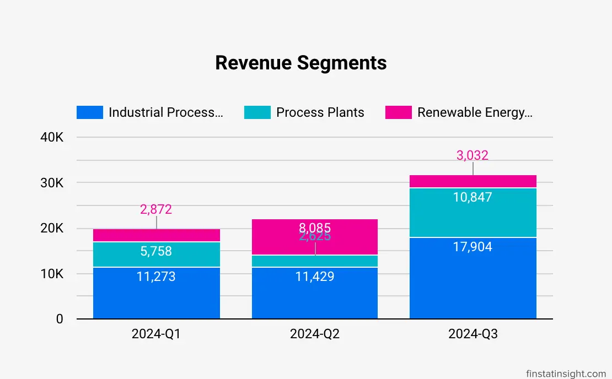
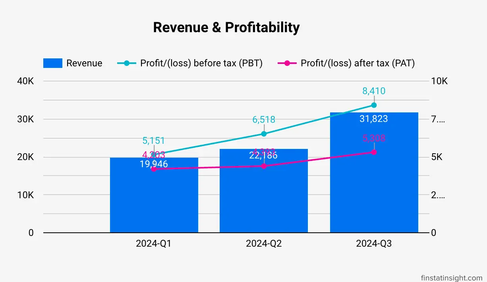

### Key Developments in Q3 2024 for Kawan Renergy Berhad
These are the key summary highlights noteworthy events and changes within Kawan Renergy Berhad during the third quarter of 2024, ending July 31, 2024.

#### 1. Financial Performance and Position
- **Substantial Revenue Increase:** The company recorded revenue of RM 31.8 million for Q3 2024, marking a significant increase of 43.4% compared to the previous quarter. This growth was primarily driven by the Industrial Process Equipment segment, which accounted for RM 17.9 million, representing 56.3% of the total revenue.
- **Improved Profitability:** Kawan Renergy Berhad achieved a profit before tax of RM 8.4 million in Q3 2024. This reflects an increase of 29.0% compared to the preceding quarter. The improved profitability can be attributed to an enhanced gross profit margin, which rose from 33.8% in Q2 to 36.7% in Q3.
- **Strong Cash Position:** The company's cash and cash equivalents at the end of Q3 2024 stood at RM 56.5 million, demonstrating a significant increase compared to the beginning of the period. This positive cash flow resulted from operational profitability and financing activities, including proceeds from the company's IPO.

#### 2. Strategic Initiatives and Developments
- **Name Change:** To better reflect its business segment performance, a subsidiary of the Group changed its name from Magenko Renewables (Penang) Sdn. Bhd. to Magenko Bio Energy Sdn. Bhd. This move suggests a strategic focus on the biogas energy sector.
- **Acquisition Progress:** Kawan Renergy Berhad's wholly owned subsidiary, KESB, entered into agreements to acquire a 51% stake in I Precision Sdn Bhd (“IPSB”) for RM 2.4 million on September 24, 2024. The acquisition is pending completion. This strategic move could potentially expand the company's capabilities and market reach.
- **Order Book Strength:** The company has a healthy order book totaling RM130.5 million as of July 31, 2024. This robust order book suggests a positive outlook for future revenue generation and reinforces the company's growth potential across its various business segments.

#### 3. Ongoing Strategies and Future Outlook
- **Biomass Power Plant Construction:** Kawan Renergy Berhad intends to construct a new 2MW biomass power plant. This initiative aims to expand the company's power generation capabilities and increase its recurring income base.
- **Biogas Power Plant Improvement:** The company plans to enhance the output of its landfill biogas power plant by implementing an anaerobic digestion system to convert agricultural waste into biogas. This upgrade is expected to boost electricity generation and contribute to the company's revenue from renewable energy.
- **Production Process Upgrade:** Kawan Renergy Berhad has plans to invest in additional machinery and equipment to upgrade its production processes, aiming to improve efficiency, reduce manpower reliance, and achieve higher precision in its manufacturing operations.

Overall, Kawan Renergy Berhad's third quarter of 2024 was marked by positive financial results, strategic initiatives, and a strong order book. The company's ongoing efforts to expand and diversify its operations, along with its focus on renewable energy, position it for continued growth and success.

###  Kawan Renergy Berhad Q3-2024 Financial Performance
Kawan Renergy Berhad's financial performance for Q3 2024, ending July 31, 2024, showed robust revenue growth, healthy profit margins, and a strong cash position, reflecting a growing company with a healthy financial standing and positive prospects for the future.

#### Revenue Growth 
Kawan Renergy Berhad achieved significant revenue growth in Q3 2024, reaching RM 31,823,000. This marks a 43.4% increase compared to the preceding quarter (RM 22,186,000). The sources attribute this growth to the increased revenue contribution from both **Industrial Process Equipment** and **Process Plants** segments. Notably, the Industrial Process Equipment segment experienced the most significant increase, exceeding 56% growth compared to Q2. The Renewable Energy and Co-generation plants segment experienced a decrease in revenue, which may be attributed to the completion of project milestones.

#### Profitability
The company maintained a healthy gross profit margin of 36.7% in Q3, compared to 33.8% in the previous quarter, indicating efficient management of its cost of sales. Profit before tax for Q3 reached RM 8,410,000, representing a 29.0% increase compared to Q2's profit of RM 6,518,000. This increase in profitability can be attributed to the overall improvement in gross profit margin.

#### Strong Financial Position
Kawan Renergy Berhad's total assets stood at RM 124,341,000 as of July 31, 2024, with total liabilities at RM 35,002,000, indicating a low leverage position. This suggests a healthy financial standing, characterized by a robust asset base and manageable debt levels.

#### Robust Cash Flow
The company generated positive cash flow from its operations in Q3 2024, amounting to RM 5,073,000. The cash flow statement reveals investments in operations, evident in the RM 823,000 used in investing activities, potentially for property, plant, and equipment acquisition. A significant portion of cash was allocated to financing activities (RM 13,151,000), likely for loan repayments, dividend payments, and other financing-related transactions. Despite these cash outflows, Kawan Renergy Berhad concluded Q3 2024 with a substantial increase in its cash and cash equivalents, reaching RM 56,561,000, signifying strong cash generation capabilities.



#### Factors Influencing Financial Position:
Listing on ACE Market: Kawan Renergy Berhad's listing on the ACE Market of Bursa Securities on May 29, 2024, was a significant event that influenced the company's financial position. The Initial Public Offering (IPO) generated gross proceeds of RM 33,000,000, which has been allocated for various strategic initiatives, including investments in a new power plant, output improvement of an existing plant, purchase of machinery, repayment of borrowings, and working capital.

#### Business Expansion and Diversification
Kawan Renergy Berhad is actively pursuing business expansion and diversification strategies to enhance its revenue streams and profitability. The company plans to construct a new 2MW biomass power plant and improve the output of its landfill biogas power plant, aiming to diversify its income base and generate more recurring revenue.

#### Industry Outlook
The industrial process equipment and biogas industries in Malaysia are experiencing favorable growth, driven by increasing FDI inflows, economic growth, and government initiatives supporting renewable energy. This positive industry outlook contributes to the growth potential of Kawan Renergy Berhad.

### Prospect & Order Book
As of July 31, 2024, Kawan Renergy Berhad has a healthy order book totaling RM 130.5 million. This substantial order book indicates a positive outlook for the company's future revenue and growth prospects.

The size of the order book suggests that:
- Kawan Renergy Berhad is well-positioned to capitalize on the favorable growth prospects of the industrial process equipment and biogas industries in Malaysia.
- The company's reputation for quality and expertise is attracting significant customer interest and driving sales.
-  The company's strategic investments, including the construction of a new biomass power plant and the enhancement of its existing biogas power plant, are likely to further contribute to its order book in the future.

It's crucial to recognize that an order book is not a guarantee of future revenue. Several factors can influence the actual realization of revenue from the order book, including:

- **Project execution risks:** Delays or unforeseen challenges in project execution could impact revenue recognition.
- **Project execution risks:** Changes in customer requirements or financial circumstances could lead to order cancellations or modifications, affecting the final revenue.
- **Economic conditions:** Adverse changes in the macroeconomic environment could impact customer spending and potentially lead to order reductions.

### Latest 3 Quarters Profit & Loss Statements Analysis

Below is table consists of last 3 quarters Profit & Loss Statements data.
| **Quarters**          | 2024-Q1        | 2024-Q2        | 2024-Q3        |
|-----------------------|----------------|----------------|----------------|
| Years                        | 2024      | 2024      | 2024      |
| Revenue                      | 19,946    | 22,186    | 31,823    |
| Cost of sales                | -13,773   | -14,682   | -20,136   |
| Gross profit (GP)            | 6,173     | 7,504     | 11,687    |
| Other income                 | 70        | 131       | 40        |
| Administrative expenses      | -1,126    | -1,228    | -3,064    |
| Other expense                | -132      | -56       | -388      |
| Profit/(loss) from Operations| 4,985     | 6,351     | 8,275     |
| Finance Income               | 281       | 257       | 257       |
| Finance costs                | -115      | -90       | -122      |
| Profit/(loss) before tax (PBT)| 5,151    | 6,518     | 8,410     |
| Taxation                     | -948      | -2,125    | -3,102    |
| Profit/(loss) after tax (PAT)| 4,203     | 4,393     | 5,308     |

### About Kawan Renergy Berhad

[Kawan Renergy Berhad](https://www.kenergy.com.my/), incorporated in Malaysia and registered with the number 202201039658 (1485355-U), specializes in providing design, fabrication, installation, and commissioning solutions for industrial process equipment, process plants, and renewable energy and co-generation plants.

**Location**
- 9, Jalan USJ 19/2, UEP Subang Jaya, 47630 Subang Jaya, Selangor, Malaysia.

**Listed on Bursa Malaysia**
- Listed on the **Ace Market** of Bursa Malaysia,
- Dated 29-May-2024, under the stock code **0307**.
- Sector: Industrial Materials, Components & Equipment.

