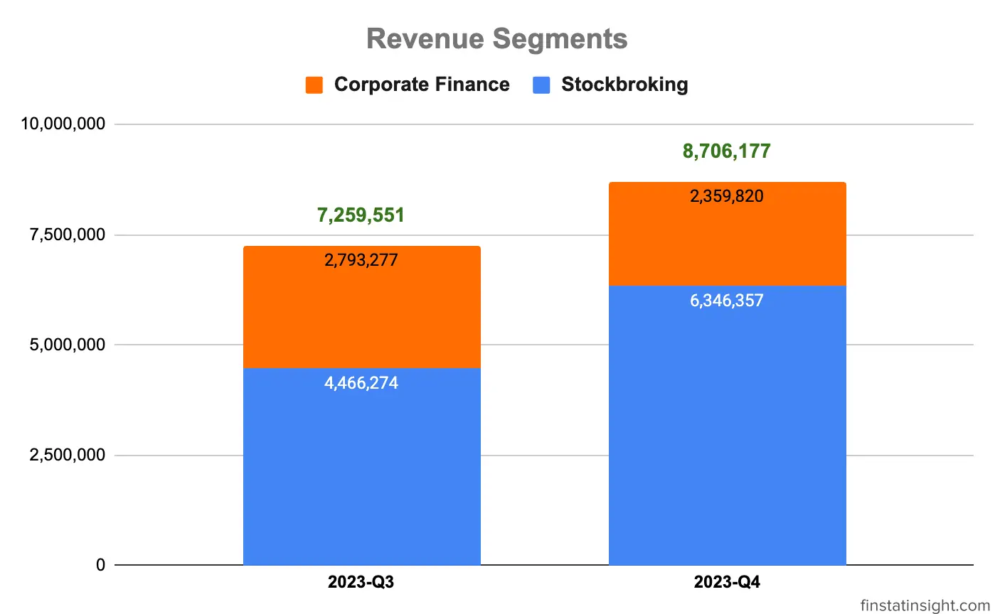
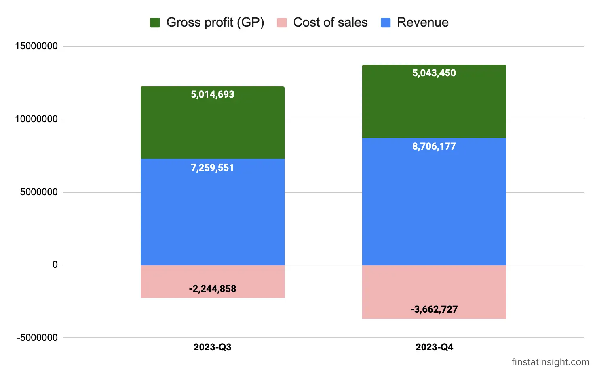
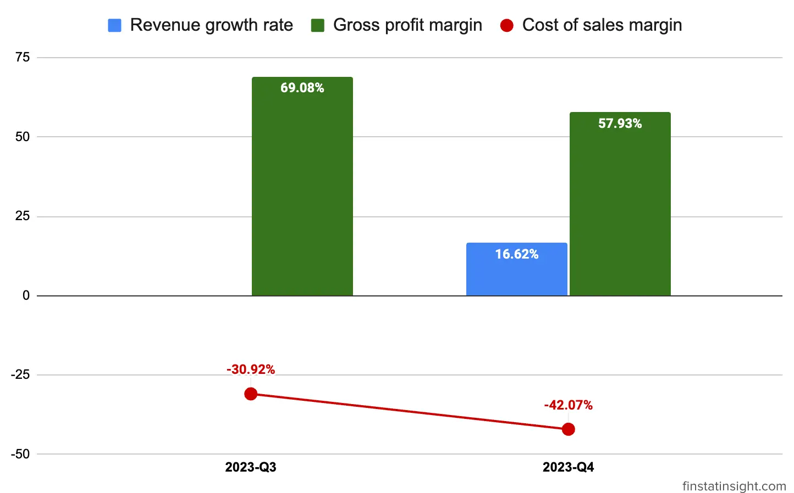
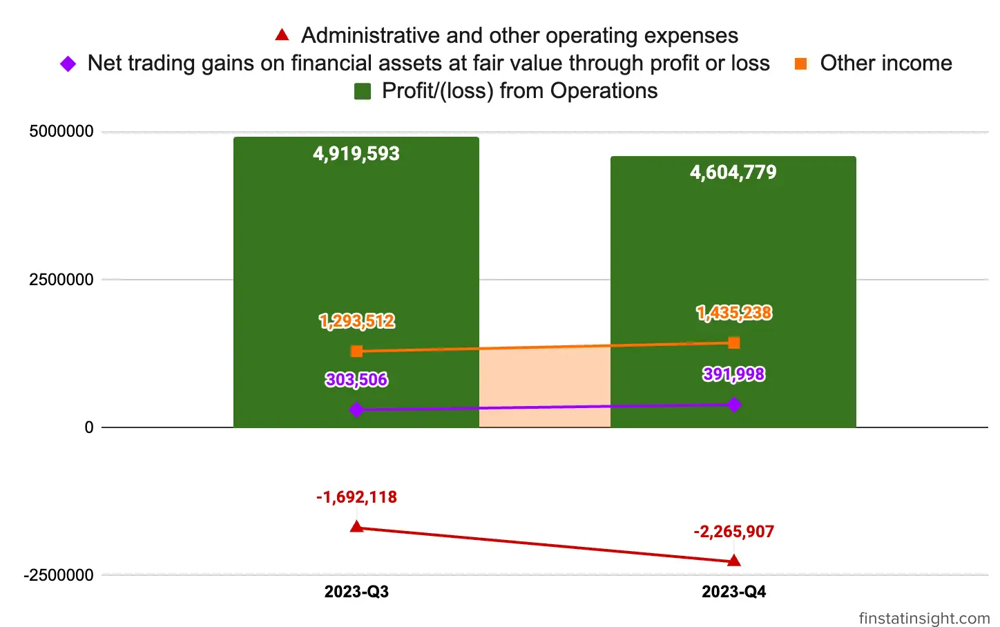
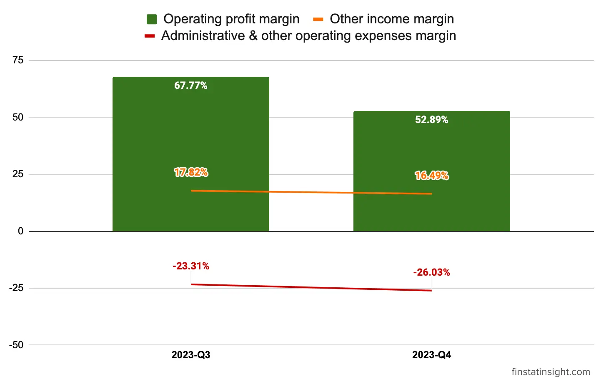
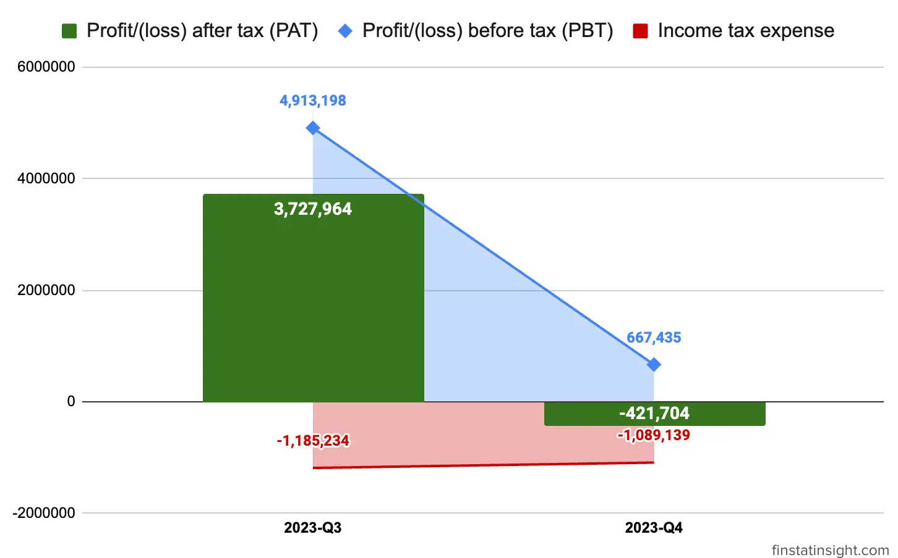
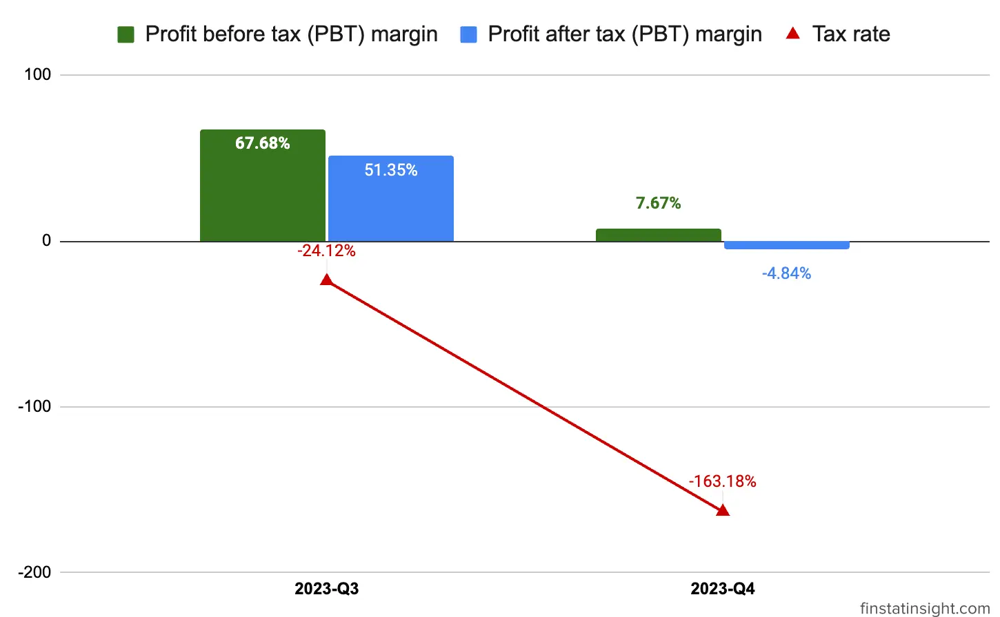

### Mercury Securities Berhad Q4-2023 Summary

In the current quarter Q4-2023 concluding on October 31, 2023, **Mercury Securities Berhad** achieved a revenue of RM8.71 million which mainly from these 2 segments below.

1. **Stockbroking segment** recorded a revenue of RM6.35 million (72.90%) in the current financial quarter. The 72.90% revenue of the Stockbroking segment are derived from:
|                          | 31.10.2023 |
|--------------------------|------------|
| Brokerage fees           | 3,681,320  |
| Margin income            | 1,744,914  |
| Underwriting and Placement Fees | 915,148  |
| Nominees fees            | 4,975      | 
| Total                    | 6,346,357  |

2. **Corporate Finance** segment contributed revenue of RM2.36 million (27.10%) in the current financial quarter. During the financial year, the corporate finance team successfully listed 2 companies on the ACE Market of Bursa Securities and also completed several secondary fund raising exercises, accounting for the underwriting and placement fees.

 

**Latest 2 Quarters Profit and Loss Statements Table**

| Quarters | 2023-Q3    | 2023-Q4    |
|-----------|------------|------------|
| Periods   | 7/31/2023   | 10/31/2023  |
| Revenue   | 7,259,551  | 8,706,177  |
| Cost of sales | -2,244,858 | -3,662,727 |
| Gross profit (GP) | 5,014,693 | 5,043,450 |
| Other income | 1,293,512  | 1,435,238  |
| Net trading gains on financial assets at fair value through profit or loss | 303,506 | 391,998 |
| Administrative and other operating expenses | -1,692,118 | -2,265,907 |
| Profit/(loss) from Operations | 4,919,593 | 4,604,779 |
| Listing expenses | - | -3,931,652 |
| Finance costs | -6,395 | -5,692 |
| Profit/(loss) before tax (PBT) | 4,913,198 | 667,435 |
| Income tax expense | -1,185,234 | -1,089,139 |
| Profit/(loss) after tax (PAT) | 3,727,964 | -421,704 |
| Other comprehensive income, net of tax: | | |
|   Fair value adjustment on other investments | - | 30,126 |
|   Realisation of revaluation surplus upon depreciation | - | -31,224 |
|   Transfer of revaluation surplus to retained profit | - | 31,224 |
| Total comprehensive income for the financial period | 3,727,964 | -391,578 |
| Earnings per share | | |
|   - Basic | 0.51 | -0.15 |
|   - Diluted | 0.51 | -0.15 |

**Revenue Growth:**
The revenue increased from RM 7.2M in 2023-Q3 to RM 8.7M in 2023-Q4, showcasing a positive growth trend.

**Costs and Gross Profit:**
Cost of sales increased from RM -2.2M to RM 3.6M, while gross profit increased slightly compare to previous quarter. 

**Revenue Growth and Gross Profit Margin:**
Looking this quarter, the revenue growth is 16.62% and gross profit margin is 57.93%. Compared to previous quarter, the gross profit margin reduced by 11%, due to increased of cost of sales margin this quarter.

 

**Other Income:**
Other income increased gradually from RM 1.293M to RM 1.43M, contributing positively to the overall income.

**Administrative & Other Operating Expenses:**
Administrative & other operating expenses elevated from RM 1.69M to RM 2.26M in this quarter.

**Profit from Operations:**
Profit from operations decreased from RM 4.9M in 2023-Q3 to RM 4.6M in 2023-Q4, mainly due to increased in the administrative & other operating expenses.

Looking at the charts trends on the profit from operations from quarters to quarters, Mercury's core business activities is still maintain its profit well on both quarters, with others income show gradual increase which is good for the business.

On its operation profit margin, Mercury Securities recorded margin above 50% which is really good for the business.

**Finance Costs:**
Finance costs reduced from -6,395 to -5,692 in this quarter.

**Profit Before Tax (PBT):**
PBT increased drop significanly from RM 3.7M to RM -421,704 due to one off non-recurring listing expenses of RM 3.93 million. Without that, the Group would have recorded PBT of RM4.60 million.

Apart from it, there are other 2 factors contributed to lower PBT in this quarter as stated in the financial statement:
1. provision for expected credit loss of RM0.23 million from 2 corporate finance clients and
2. increase of staff costs of RM0.45 million due to higher headcount in the corporate finance teams as part of ongoing efforts to enhance capacity.

In summary, Mercury Securities experienced growth in revenue specifically in stockbroking segment this quarter. Without the one off non-recurring listing expenses of RM 3.93 million, the Group would have recorded PBT of RM4.60 million. With gross profit margin above 57% and profit from operation margin above 52%, Mercury Securities is one of the compeling company to consider for investment portfolio.

At the time the Group released the 2023-Q4 financial statement, eventhough it recorded -421,704 loss in profit after tax, the market still react positively the day after (27-December-2023) with RM 0.63 closing position.

>The financial sector is envisaged to remain resilient and stable, driven by a robust banking system which continues
to support financial intermediation activities, benefitting from positive growth projections and
an improving labour market
>
> <cite>– Mercury Securities Berhad Q4-2024 Interim Financial Report</cite>
***



### Group Prospects
The Group is committed to unwavering resolve, persisting in its pursuit of revenue growth while strategically optimizing operational costs. This commitment involves a multifaceted approach:

1. Improving the Group's online trading platform to enhance client acquisition endeavors and elevate the overall client experience, thereby augmenting the Group's market share.

2. Expanding the proprietary trading teams and establishing an algorithmic trading desk to bolster trading capabilities.

3. Scaling the Group's share margin financing portfolio judiciously and in adherence to acceptable credit criteria. This expansion will be executed using the IPO proceeds allocated for this purpose, leading to increased margin income and brokerage fees.

4. Prioritizing origination efforts to secure additional mandates, alongside executing and finalizing the existing pipeline of IPO mandates and corporate finance proposals. This strategic focus aims to fortify corporate advisory services and augment fee-based growth.

5. Advancing the digitalization program for the stockbroking business and operations to stay at the forefront of technological advancements.

Simultaneously, the Group is actively introducing new products and services for its clients, persistently striving to broaden and diversify its client base. This multifaceted approach underscores the Group's dedication to sustained growth, innovation, and excellence in client services within the financial landscape.

### About Mercure Securities Berhad

**Mercury Securities Berhad (MSGB)** is a full-fledged investment banking and stockbroking firm in Malaysia. Mercury Securities boasts a strong track record and reputation in the Malaysian capital market. The company emphasizes its commitment to providing personalized service and innovative solutions to its clients.

Mercury Securities Berhad currently operates under two registered entities:
1. Mercury Securities Sdn Bhd (Established 1984) for stockbroking and related services.
2. Mercury Securities Group Bhd (Established 2021) for corporate finance activities.

The company is headquartered in Butterworth, Penang, with 7 branch offices across Malaysia.

**Headquarters Location**
- Ground, 1st, 2nd & 3rd Floor, JKP Business Centre, Lorong Bagan Luar Dua, 12000 Butterworth, Seberang Perai.

**Listed on Bursa Malaysia**
- Listed on the **ACE Market** of Bursa Malaysia,
- Dated September 19, 2023, under the stock code **0285** at 27 sen a share.
- Sector: Other Financials.

**Business Segments:**

1. Stockbroking:
- Provides execution services for equities and equity-related instruments listed on Bursa Malaysia.
- Offers access to global markets through partnerships with foreign brokers.
- Two trading platforms available: Mercury StraightThru and MST28.

2. Corporate Finance:
- Licensed by the Securities Commission Malaysia for activities like IPOs, M&As, takeovers, and capital raising.
- Consistently ranked among the leaders in deal count for M&As and Equity Offerings since 2016 (as per Bloomberg).

3. Nominees & Custodian Services:
- Acts as a nominee for client's securities holdings.
- Provides safekeeping and management of securities.

4. Share Margin & ESOS Financing:
- Offers margin financing for stock purchases.
- Provides financing for employees' exercise of Employee Stock Option Schemes (ESOS).

5. Underwriting:
- Participates in underwriting of Initial Public Offerings (IPOs) and other fund-raising exercises.

6. Private Placement:
- Facilitates private placements of securities for companies seeking to raise capital from a limited pool of investors.

7. Research:
- Provides equity research and market analysis to clients.



|                                               | 31.10.2023        | 31.10.2022        |
|-----------------------------------------------|-------------------|-------------------|
| **CASH FLOWS FROM OPERATING ACTIVITIES**      |                   |                   |
| Profit before tax                             | 12,460,323        | N/A               |
| Adjustments for:                              |                   |                   |
| - Accretion of lease interest                 | 27,733            | N/A               |
| - Allowance for expected credit losses        | 84,471            | N/A               |
| - Depreciation of:                            |                   |                   |
|   - Property, plant and equipment            | 636,508           | N/A               |
|   - Right-of-use assets                       | 238,772           | N/A               |
| - Dividend income                             | (56,128)          | N/A               |
| - Interest income                             | (3,016,963)       | N/A               |
| - Loss on disposal on property, plant and equipment | 1,636       | N/A               |
| - Property, plant and equipment written off   | 85                | N/A               |
| - Gain on changes in fair value of investment properties | (300,000) | N/A           |
| Operating profit before working capital changes | 10,076,437    | N/A               |
| - Increase in trade and other receivables     | (4,453,406)       | N/A               |
| - Decrease in deposits and prepayments        | 2,171,963         | N/A               |
| - Decrease in trade and other payables        | (5,267,222)       | N/A               |
| Cash generated from operations                | 2,527,772         | N/A               |
| - Income tax paid                             | (4,665,174)       | N/A               |
| **Net cash used in operating activities**     | (2,137,402)       | N/A               |
| **CASH FLOWS FROM INVESTING ACTIVITIES**      |                   |                   |
| - Interest received                           | 3,016,963         | N/A               |
| - Dividends received                          | 56,128            | N/A               |
| - Purchase of property, plant and equipment   | (1,231,463)       | N/A               |
| - Proceeds from disposal of property, plant and equipment | 200 | N/A           |
| - Addition in other investments carried at fair value through profit or loss | (621,573) | N/A |
| **Net cash from investing activities**        | 1,220,255         | N/A               |
| **CASH FLOWS FROM FINANCING ACTIVITIES**      |                   |                   |
| - Repayment of lease liabilities              | (274,199)         | N/A               |
| - Proceeds from issuance of shares, net       | 37,631,835        | N/A               |
| **Net cash from financing activities**        | 37,357,636        | N/A               |
| **NET INCREASE IN CASH AND CASH EQUIVALENTS** | 36,440,489        | N/A               |
| Cash and cash equivalents at beginning of the financial year | 46,063,268 | N/A      |
| **CASH AND CASH EQUIVALENTS AT THE END OF THE FINANCIAL YEAR** | 82,503,757 | N/A |
