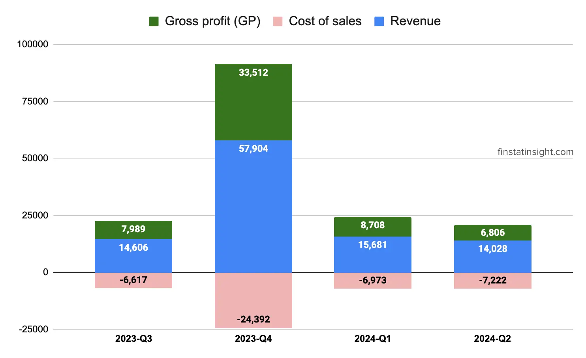
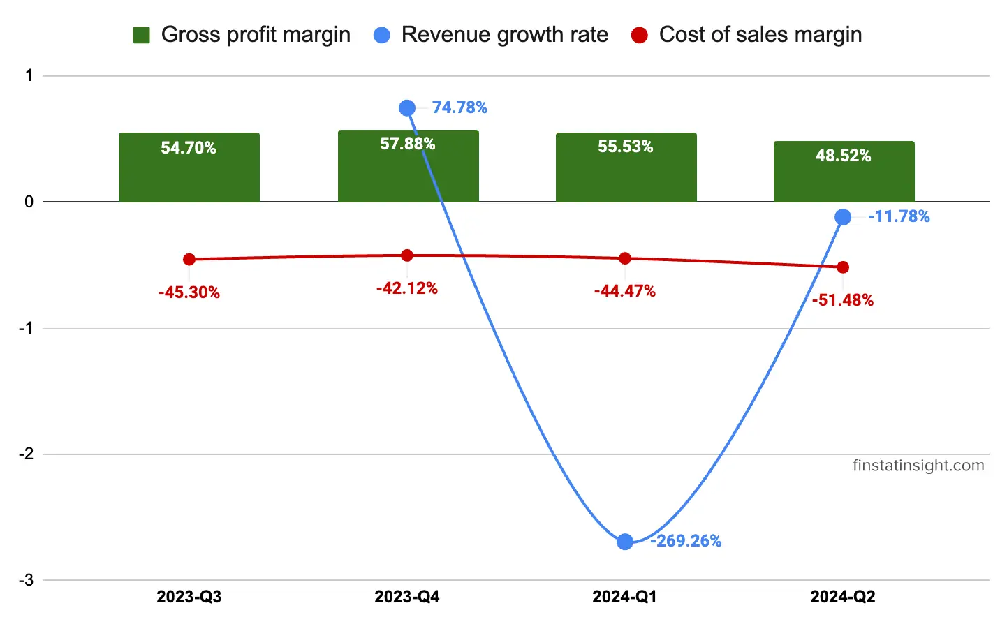
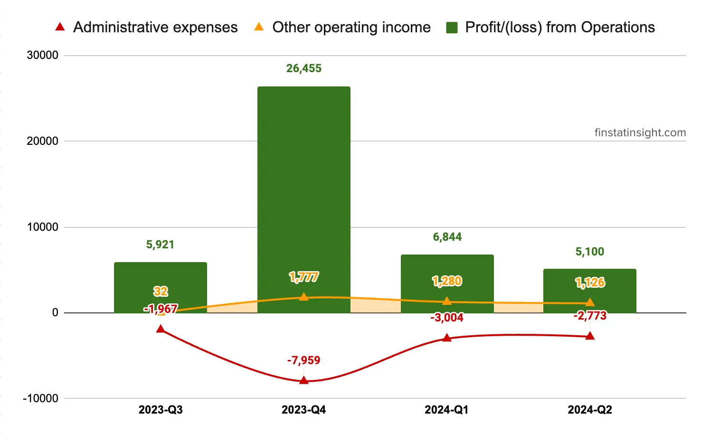
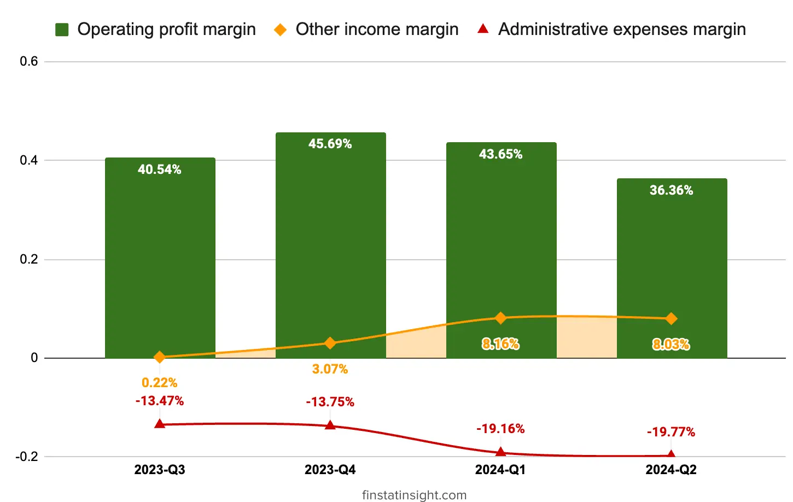
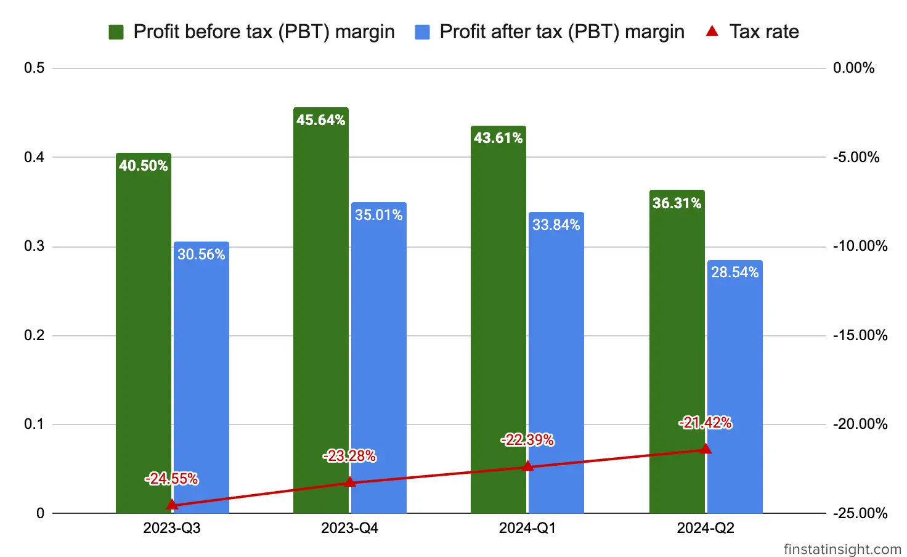
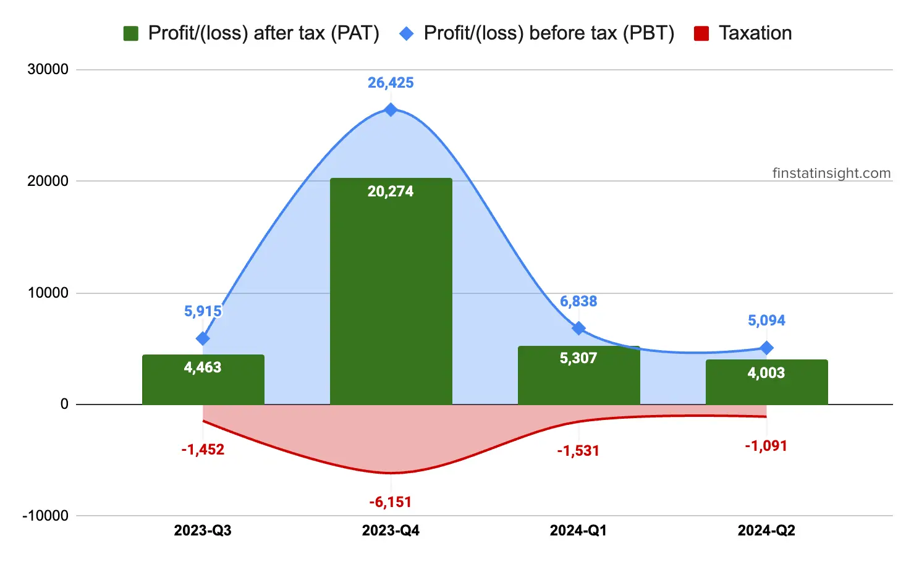

### Oppstar Berhad Q2-2024 Summary
In the current quarter, **Oppstar Berhad** achieved a noteworthy revenue of around RM14.03 million, contributing to a robust financial period with a total revenue of RM29.71 million.

During this quarter, **turnkey design services** played a pivotal role, contributing approximately RM9.51 million, constituting about 67.82% of the Group's total revenue. Notably, these projects hailed from customers in the Northeast and Southeast Asian region, showcasing the Group's regional presence.

The remaining revenue for the quarter, totaling around RM4.52 million (32.18% of the Group's total revenue), was generated from **specific design service** and **post-silicon validation service**.

In this Q2-2024, the group profit before tax (PBT) margin is 36.31% which is around 7% lower compare to previous quarter. It's still favorable profit margin which hopefully the group still able to maintain it for future quarters ahead.

### Latest 3 Quarters Profit & Loss Statements Analysis

Below is table consists of last 3 quarters Profit & Loss Statements data.

| Quarters             | 2023-Q4  | 2024-Q1  | 2024-Q2  |
|----------------------|----------|----------|----------|
| Periods              | 3/31/2023 | 6/30/2023 | 9/30/2023 |
| Revenue              | 57,904   | 15,681   | 14,028   |
| Cost of sales        | -24,392  | -6,973   | -7,222   |
| Gross profit (GP)    | 33,512   | 8,708    | 6,806    |
| Other operating income| 1,777    | 1,280    | 1,126    |
| Administrative expenses | -7,959 | -3,004  | -2,773  |
| Development expenses | -471    | -96     | -20     |
| Other operating expenses | -404  | -44     | -39     |
| Profit/(loss) from Operations | 26,455 | 6,844  | 5,100  |
| Finance costs        | -30      | -6      | -6      |
| Profit/(loss) before tax (PBT) | 26,425 | 6,838 | 5,094 |
| Taxation            | -6,151  | -1,531  | -1,091 |
| Profit/(loss) after tax (PAT) | 20,274 | 5,307 | 4,003 |
| Other comprehensive income, net of tax: |         |         |         |
| Items that may be reclassified subsequently to profit or loss: |   |   |   |
| Foreign currency translations | -31   | -1    |         |
| Total comprehensive income | 20,243 | 5,306 | 4,003 |
| Profit attributable to: |           |           |           |
| Owners of the parent | 20,354  | 5,329   | 4,008   |
| Non-controlling interests | -80 | -22     | -5     |
| Total comprehensive income attributable to: |      |      |      |
| Owners of the parent | 20,323 | 5,328 | 4,008 |
| Non-controlling interests | -80   | -22   | -5   |
| Earnings per share attributable to owners of the parent (“EPS”): |   |   |   |
| Basic (sen) | 4.25 | 0.84 | 0.63 |
| Diluted (sen) | 4.11 | 0.82 | 0.61 |

**Revenue, Cost of Sales and Gross Profit**

From the charts below, we could see clearly that Oppstar Berhad is having quite stable revenue and gross profit from quarter to quarter. Expection only for Q4-2023 which is having huge jump, around 4-5 times more than usual.

On Q2-2024, we could see the decline of revenue, which is attributed to decrease in revenue from turnkey design services and slightly higher cost of sales in the current quarter.

In term of the gross profit margin on Q2-2024 is slightly lower on 48.52% compare to Q1-2024 55.53%. Cost of sales contributing to the lower gross profit margin as well with 51.48% compare to 44.47% earlier quarter.

Revenue growth margin still volatile but it is improving on this Q2-2024 with -11.78%.

> The Board remains cautiously optimistic on the future prospects of the Group in light of the softening outlook in
the semiconductor industry in the near future.
> <cite>– Oppstar Berhad Q2-2024 Interim Financial Report</cite>
***

**Profit from Operations**

Oppstar Berhad recorded RM 5,1 millions profit from operations in this Q2-2024 versus RM 6,8 millions.

It is slightly lower at 36.36% operating profit margin versus previous quarter which able to achieved 43.65% operating profit margin. Administrative expenses rate are still similiar for last 2 quarters which is around 19%.

**Profit Before and After Tax:**
Looking at the profit before and after tax margin rate chart, Oppstar Berhad is having lower PBT on this Q2-2024, which is 36.31% and 28.54% PAT respectively. With the lower revenue, effective tax rate (21.42%) is lower than statutory tax rate (24%) in this quarter.

**Earnings Per Share (EPS):**
Earnings per share (sen) have shown a decline in Q2-2024, reaching 0.63 sen (basic) from 0.84 from previous quarter.

> In the near term, the Group does not anticipate significant changes in its principal geographical areas of
business. However, the Group is actively exploring new business opportunities with current and potential new
partners. 
>
> <cite>– Oppstar Berhad Q2-2024 Interim Financial Report</cite>
***

In summary, the company's performance has been notably commendable, marked by gross profit margin above 40% and proft before tax margin above 35% every quarters.



### Growth Plan

From the Q2-2024 Oppstar Berhad interm financial report, stated 3 key points for investor.

-  The Group will continue to execute the strategies outlined in the prospectus, with a focus on expanding its IC design presence overseas, particularly in markets where it can maintain a competitive advantage. 
- The Group is also working on strategies to provide more sustainable revenue to its business. Such strategies will include enhancing its recurring revenue by expanding the Group’s range of services.
- The Group is optimistic about its ability to successfully hire key talent, which it believes that this will play a crucial role in meeting its business growth objectives in the medium term. The Group is confident that attracting skilled and dedicated professionals will strengthen its capabilities and position it for sustained success in the everevolving market landscape. 

### About Oppstar Berhad

Oppstar Berhad is a leading Malaysian semiconductor design company which founded in 2014 by three IC design industry experts, with the vision to become a preeminent global Semiconductor brand in R&D. 

Core Business: Providing a full spectrum of integrated circuit (IC) design services, including:
- Analog & Mixed-Signal ICs: Power management, sensors, amplifiers.
- Digital ICs: Processors, controllers, interfaces.
- ASICs (Application-Specific Integrated Circuits): Custom chips for specific applications.
- SoCs (System on Chips): Integrated circuits housing both digital and analog components.

**Headquarters Location**
- Level 6, I2U Building, Sains@USM 10, Persiaran Bukit Jambul 11900 Bayan Lepas, Pulau Pinang, Malaysia.

**Listed on Bursa Malaysia**
- Listed on the **ACE Market** of Bursa Malaysia,
- Dated 15-March-2023, under the stock code **0275**.
- Sector: Semiconductor.

