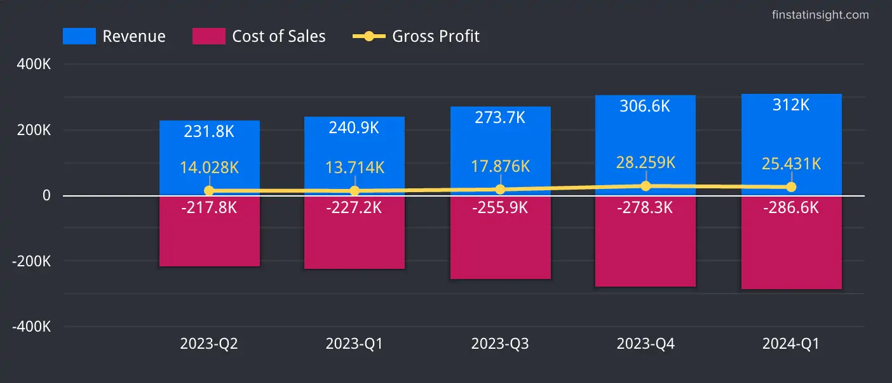
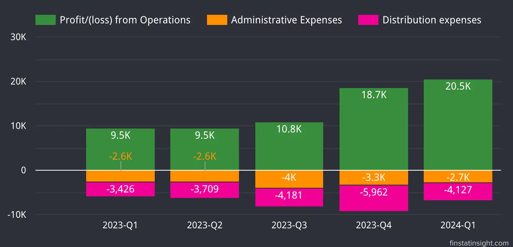
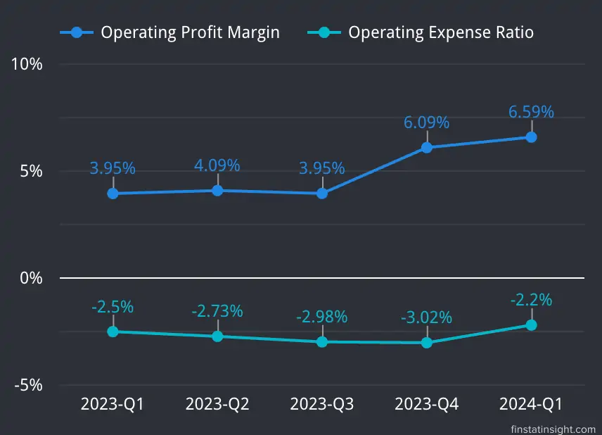
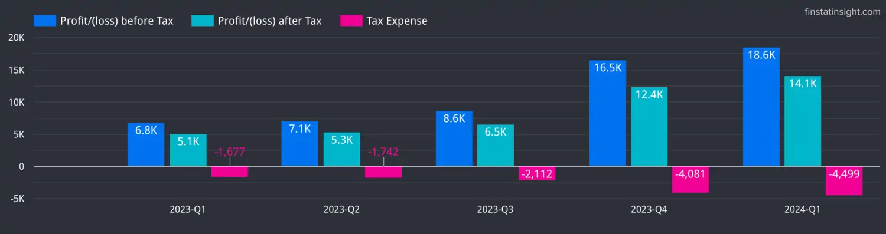
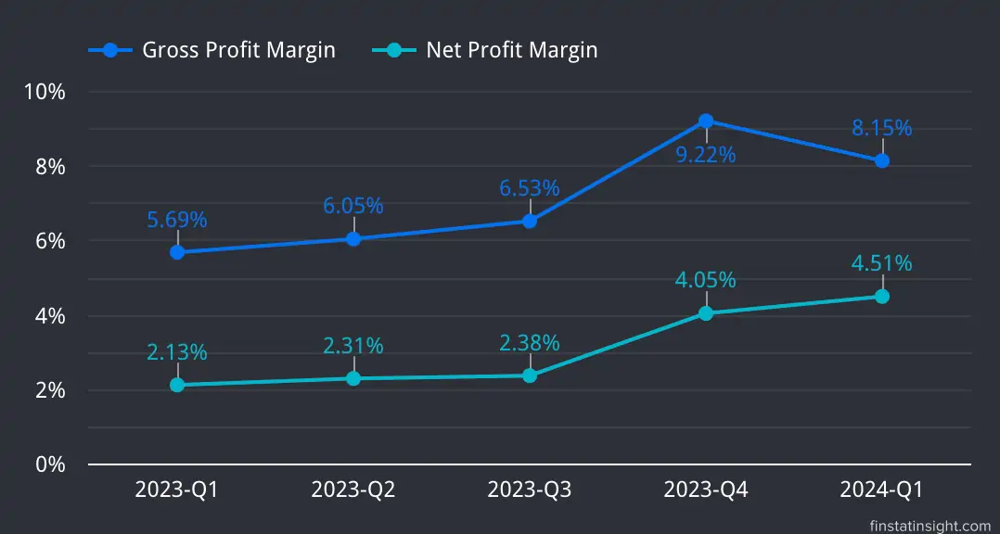

### Southern Cable Group Berhad Q1-2024 Summary
In the quarter ending March 31, 2024, the Group's revenue rose to RM312.03 million, up from RM240.93 million in the same quarter last year, marking a 29.51% increase.

The Malaysian market was the primary revenue source, contributing 98.65% of total revenue, while international sales made up the remaining 1.35%. Sales in Malaysia grew by 35.54%, while overseas sales dropped by 69.50% compared to the previous year.

The revenue boost was mainly due to higher sales volumes and adjusted prices for power cables and wires in line with raw material costs.

The power cables and wires segment generated RM277.95 million, or 89.08% of total revenue, up by 33.73% from RM207.84 million last year.

The remaining RM34.08 million, or 10.92% of revenue, came from the communication cables and wires, control and instrumentation cables and wires, and other segments, with a combined increase of 2.99% from RM33.09 million last year, primarily due to higher sales of aluminium rods.

Profit before tax soared to RM18.57 million this quarter, up from RM6.82 million last year, a 172.44% rise, driven by higher revenue, a better product mix, improved sales margins from lower plastic compound prices, and reduced finance costs.

The Group’s revenue for the current quarter grew by 1.79% to RM312.03 million from RM306.55 million in the previous quarter ending December 31, 2023, due to higher sales volumes of power cables and wires, and increased sales of aluminium rods.

Profit before tax increased by 12.52%, rising from RM16.51 million in the previous quarter to RM18.57 million in the current quarter. This growth was driven by improved efficiency, higher other income, lower administrative and income tax expenses, and reduced finance costs.

### Latest 3 Quarters Profit & Loss Statements Analysis

Below is table consists of last 3 quarters Profit & Loss Statements data.

| Quarters                       | 2023-Q3 | 2023-Q4 | 2024-Q1 |
|--------------------------------|---------|---------|---------|
| Periods                        | 30-Sep-2023 | 31-Dec-2023 | 31-Mar-2024 |
| **Revenue**                    | 273,747 | 306,553 | 312,027 |
| **Cost of Sales**              | -255,871 | -278,294 | -286,596 |
| **Gross Profit**               | 17,876 | 28,259 | 25,431 |
| **Other Income**               | 1,112 | 90 | 1,975 |
| **Distribution expenses**      | -4,181 | -5,962 | -4,127 |
| **Administrative Expenses**    | -3,986 | -3,308 | -2,731 |
| **Impairment loss on trade receivables** |  | -394 |  |
| **Other expenses**             | -1 | -1 |  |
| **Profit/(loss) from Operations** | 10,820 | 18,684 | 20,548 |
| **Finance Costs**              | -2,182 | -2,178 | -1,976 |
| **Profit/(loss) before Tax**   | 8,638 | 16,506 | 18,572 |
| **Tax Expense**                | -2,112 | -4,081 | -4,499 |
| **Profit/(loss) after Tax**    | 6,526 | 12,425 | 14,073 |
| **EPS (sen)**                  | 0.82 | 1.55 | 1.76 |

**Revenue, Cost of Sales and Gross Profit**

From the charts below, Southern Cable Group Berhad revenue has been increasing over the quarters. Starting from 231.8K in 2023-Q2, it rises consistently to 312K in 2024-Q1. The cost of sales is also increasing over the quarters, following the revenue trend.

Despite the increasing revenue and cost of sales, the gross profit has shown only minor increases with some fluctuations, indicating that the company's profit margins might be under pressure. Southern Cable Group Berhad is experiencing growth in revenue but is also facing rising costs, which is affecting its gross profit margins. The company should focus on controlling costs to enhance profitability as revenues continue to grow. One of the plan which Southern Cable gonna do to reduce the costs is to increase the plastic insulation options compounding capacity.

Citing from [Southern Cable Annual Report 2023](https://www.klsescreener.com/v2/announcements/view/6893469), the Southern Cable Group expecting their plastic compounding factory on PT 4845 to begin construction work in the first half of 2024, providing them with an additional 4,200 MT of annual capacity. The new plastic compound factory will enable Southern Cable to produce a new range of plastic compounds, including Polyolefin (PO), Polyethylene (PE), and Cross- Linked Polyethylene (XLPE). 

The new plastic compounds will not only increase the plastic insulation options for their customers but also **help reduce costs**. This new factory is targeted to be completed in the second half of 2024 and will increase their annual plastic compounding capacity by 54% to 12,000 MT, from 7,800 MT currently.

> Barring unforeseen circumstances, Southern Cable’s outlook for FY2024 remains positive, supported by its annual cable and wire production capacity of 41,980 km, which has increased from 40,780 km as at 31 December 2023, after the commencement of its newly installed
production line for medium-voltage power cables and wires in March 2024.
> <cite>– Southern Cable Group Berhad Q1-2024 Interim Financial Report</cite>
***

**Profit from Operations**

Southern Cable Group Berhad has successfully increased its operational profit over the quarters. While administrative expenses have remained stable, the rise in distribution expenses suggests the company might be investing more in distribution, which could be contributing to revenue growth. The overall financial trend appears positive with increasing operational profitability, although managing rising distribution costs will be important for sustained profitability.

**Profit Before and After Tax:**

Southern Cable Group Berhad has shown strong financial performance with continuous growth in profits before and after tax. The increase in gross and net profit margins further highlights the company's improved efficiency and profitability over the analyzed quarters. Despite a slight dip in gross profit margin in the latest quarter, the overall trend remains positive, indicating robust financial health.



### Prospect Summaries

Looking at Q1-2024 Southern Cable Group Berhad interm financial report, the Southern Cable's prospects are promising, driven by increasing demand for cables and wires in Malaysia due to ongoing development and infrastructure projects.

1) Growing Demand in Malaysia:
- Driven by ongoing development and infrastructure projects.

2) Orders in Hand (as of 31 March 2024):
- Totaling RM903.00 million, expected to be fulfilled by 2026.
- Includes contracts with Tenaga Nasional Berhad, Sarawak Energy Berhad, and Telekom Malaysia Berhad.
- Orders from EPCC contractors, resellers, and others.

3) Significant Orders in Q1 2024:
- Over RM100 million worth of power cable and wire orders for data center projects.

4) National Energy Transition Roadmap (NETR):
- Increased demand for power cables and wires.
- Supply of TÜV SÜD certified solar photovoltaic cables for renewable energy projects.

5) Production Capacity:
- Annual production capacity increased to 41,980 km as of March 2024.
- New production line for medium-voltage power cables and wires.

6) Expansion Plans:
- Acquired 7.9-acre industrial land in May 2024 for RM13.95 million.
- New facility adjacent to existing production sites in Kuala Ketil, Kedah.
- Targeting growth in the United States market.
- Capacity expansion setup to commence in 2025.

### About Southern Cable Group Berhad

[Southern Cable Group Berhad](https://www.southerncable.com.my/) is a manufacturer of cables and wires. Their extensive portfolio includes cables and wires used for power distribution and transmission, communications, as well as control and instrumentation applications.

Their cables and wires are used across various industries that range from power distribution and transmission, building and construction, infrastructure, telecommunications, manufacturing and processing industries including oil and gas processing and petrochemical plants.

Southern Cable is capable of providing full service from manufacturing to delivery cables and wires through their subsidiaries:

1) **Southern Cable Sdn Bhd (“SCSB”)**, a wholly-owned subsidiary of Southern Cable, manufactures cables and wires, and related products and services in a 473,380 square-foot production facility in Kuala Ketil, Kedah Darul Aman. They have established a loyal customer base from various industries, with notable customers including major public utilities and telecommunication providers such as TNB and Telekom Malaysia Berhad (“TM”). Beside that, SCSB also registered supplier with Sabah Electricity Sdn. Bhd., Sarawak Energy Berhad, and PETRONAS.

2) **Nextol Polymer Sdn. Bhd.**, a wholly-owned subsidiary of Southern Cable, located in Sungai Petani, Kedah Darul Aman, is involved in the manufacturing of plastic compounds such as Polyvinyl chloride (PVC) and Medium-density Polyethylene (MDPE) compounds. It provide processes for insulation, bedding and sheathing layers for SCSB cables and wires.

3) **Daya Forwarding Sdn. Bhd.**, a wholly-owned subsidiary of Southern Cable, operates within SCSB’s existing facility in Kuala Ketil, Kedah, and is involved in the manufacturing and trading of wooden cable drums used for coiling SCSB cables and wires for storage and delivery to customers.

**Location**
- Lot 42, Jalan Merbau Pulas, Kuala Ketil Industrial Estate, 09300 Kuala Ketil, Kedah

**Listed on Bursa Malaysia**
- Listed on the **Main Market** of Bursa Malaysia,
- Dated 16-October-2024, under the stock code **0225**.
- Sector: Industrial Materials, Components & Equipment.

